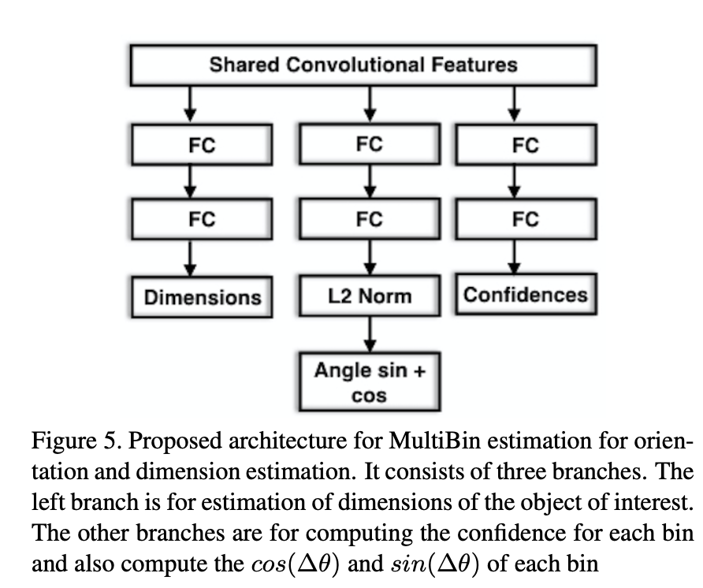
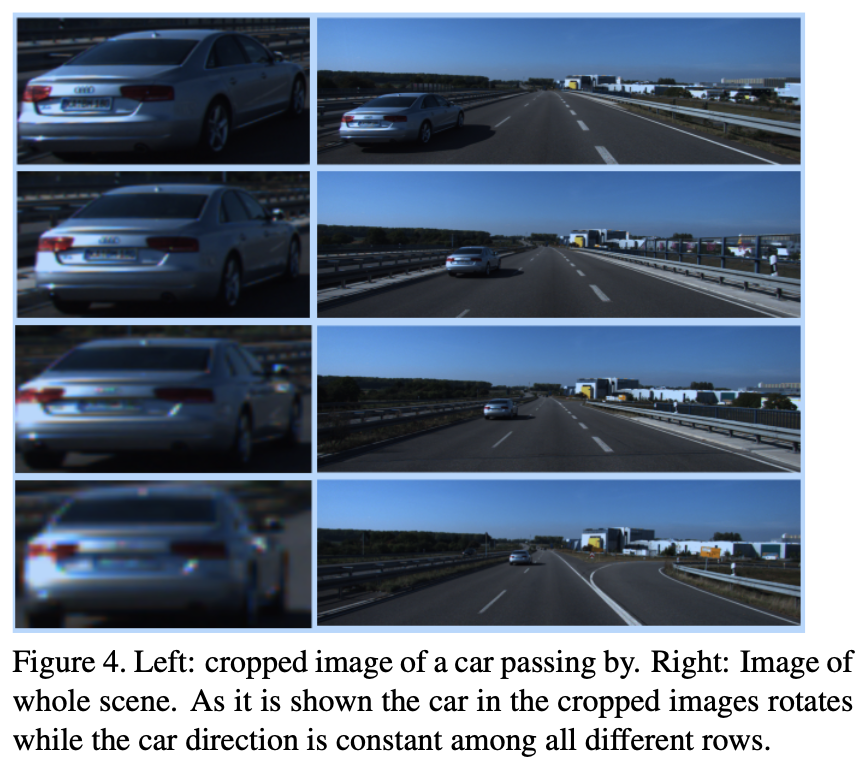
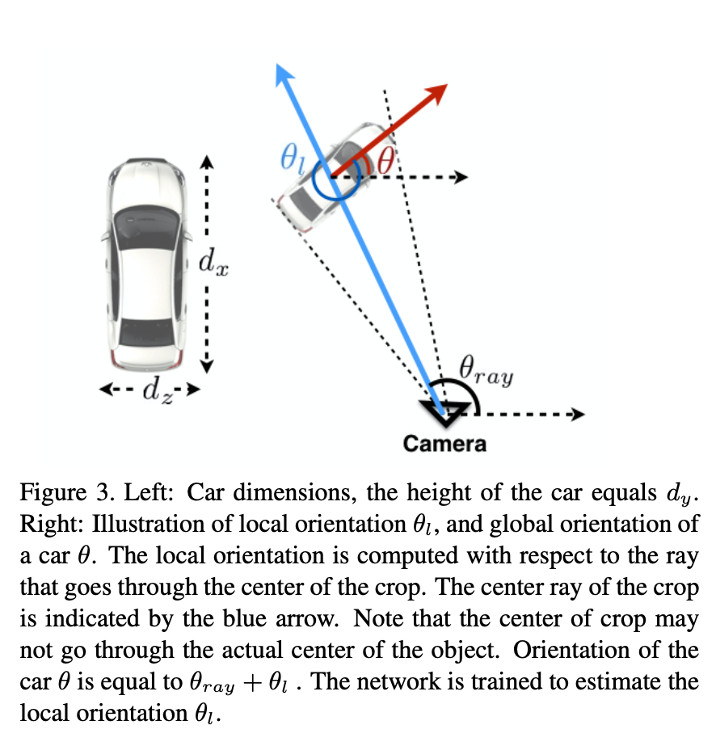

# 3D Bounding Box Estimation Using Deep Learning and Geometry 论文分析

这是Arsalan Mousavian等人发表在CVPR 2017上的单目3D检测的文章，也是第一篇使用深度神经网络预测3D框的文章。

# Motivation
目前有很多基于单目估计车辆姿态的方法一般是要求有车辆的3D模型，或者有一些方法是只估计车辆的朝向。

这篇文章是第一个用深度神经网络直接估计车辆的朝向和尺度信息的工作。

# Implementation
整体的过程大概为：先用神经网络预测车辆的朝向和长宽高的尺度，然后再根据检查的2D框，使用几何的方法进行求解。

## 3D Box参数预测

### 模型输入
采用MS-CNN结构作为特征提取网络，并预测2D框。3D框回归模型的输入是使用预测的2D框在MS-CNN最后的特征图（去掉全连接层）上取得特征区域。并且resize为224x224

### 3D预测模型结构
预测结构如下图所示

图中有三个分支，分别是用于框的尺度预测，朝向预测以及正负样本预测。对于尺度预测，第一次全连接隐藏层神经元个数为512，角度朝向隐藏层个数为256。

### 模型输出
模型的输出包含三个部分，但并不是直接预测每个部门绝对的数值。而是采用预测残差的方式。

对于尺度的回归，考虑到每种不同的车，其尺寸差异比较大，但是对于同一类车，其差异性会比较小。因此，选择每一类的均值作为预选，预测其与真值框的差值。
\[
L_{dim} = \frac{1}{n} \sum (D^* - D - \delta)^2
\]
(因此，需要对每一类都预测一个 $\delta$ ？)

对于角度的预测，需要有三个需要注意的地方。首先，是需要选择要预测的角度。通常来讲，我们最终预测的角度是被检测车辆相对于自动驾驶车体坐标系的旋转角度，而被检测车辆在图像上的成像是与车辆相对于当前车体的位置和距离有关的以及被捡车辆的角度有关系的，因此，很难从图像中直接预测车辆在车体坐标系下的朝向。可以通过以下一个例子举例说明

从上到下的图中，车辆相对于车体坐标系的朝向并没有改变，但是由于想到位置的改变导致车辆在图像中的状态发生显著的变化。

因此，作者在这里对车体坐标系下的全局朝向角度进行了分解，分解成车辆相对于车体的位置夹角和，车体的局部角度，如下图所示

在回归局部角度时，作者采用类似于设置预选框的方式（MultiBin），讲角度划分成几个区间，而在预测是，则需要预测三个值，落在该区间内的概率，以及与该区间中心角度差值的正弦值和余弦值。则角度回归的损失函数需要包括两个部分：
\[
L_{\theta} = L_{conf} + w \times L_{loc}
\]
其中 $L_{conf}$ 采用交叉熵损失函数，残差回归的损失函数采用
\[
L_{loc} = - \frac{1}{n_{\theta ^* } } \sum cos(\theta ^* - c_i - \Delta \theta_i )
\]
其中角度可以通过反正切值计算得到。

## 位置求解

根据相机成像原理，我们可以列出物体坐标系下3D框的位置与图像中2D框位置的关系，其中会涉及到3D框的尺寸，朝向，物体相对于相机坐标系下的位置，以及相机的内参。现在我们对物体的尺寸和朝向都已经有了估计，相机内参也有，我们需要需要估计物体在相机坐标系下的位置。对于每个物体3D框投影到图像上，会有8个对应点，每个点都会有4个约束方程，但是在自动驾驶场景中，考虑到车辆的滚转角和俯仰角基本都趋近于0，因此，3D框的最大最小x值一般与图像中2D框的最大最小x值是对应的。则每个2D框对应4个点（水平两个点，垂直两个点），则每个框可以对应 $4^4=64$ 个约束方程。因此可以采用最小二乘对位置进行求解。

## 参数设置

## 数据增广

## 训练过程
采用SGD方法，学习率为0.0001，迭代20000步。

## 实验结果
