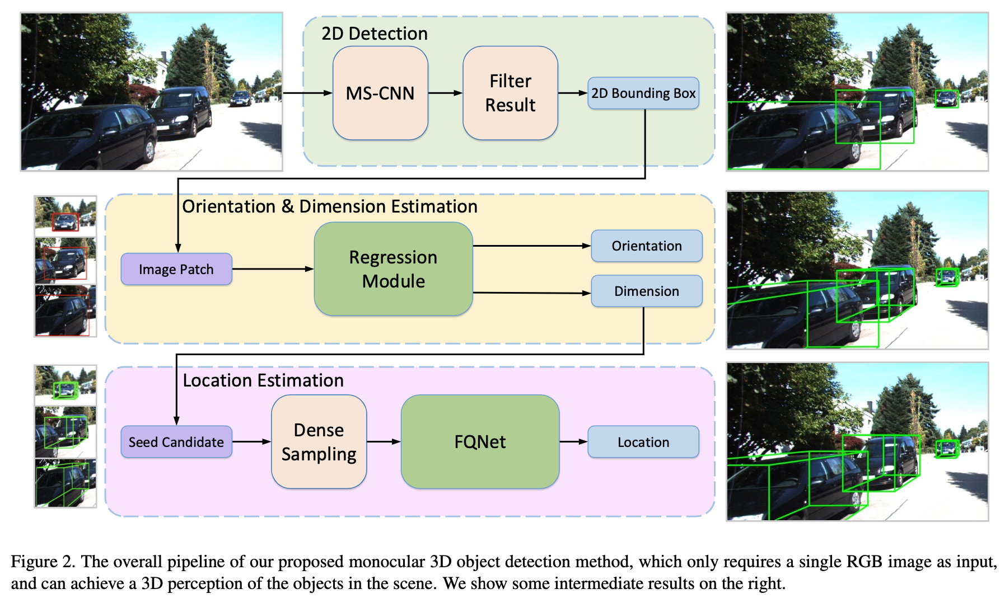
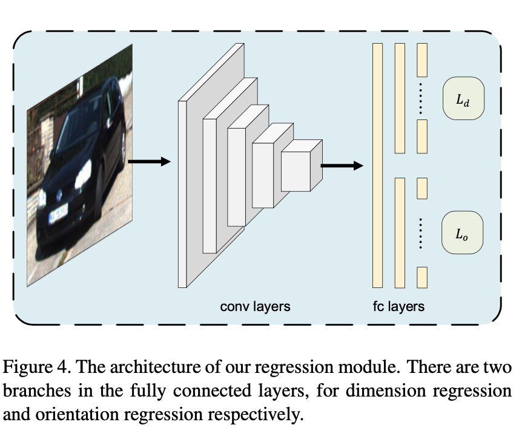
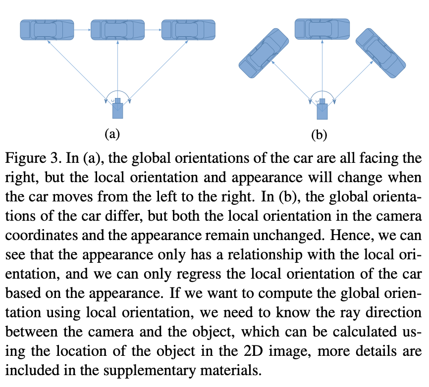
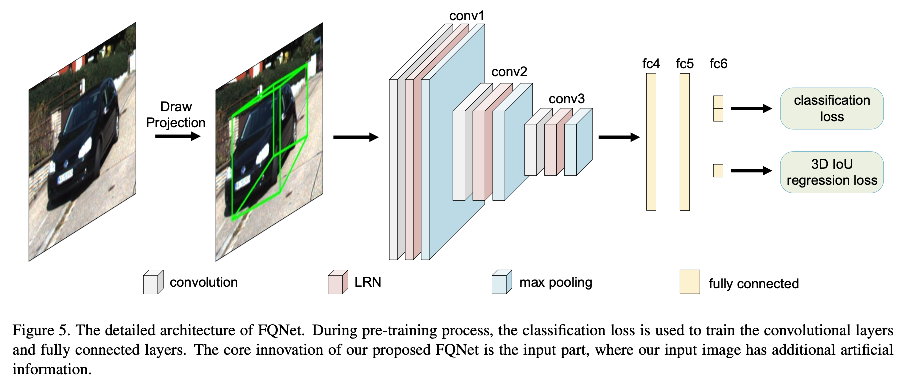

# Deep Fitting Degree Scoring Network for Monocular 3D Object Detection 论文解析
这是清华大学Lijie Liu等人与华为诺亚合作，发表在CVPR2019上的工作。

# Motivation
之前一些方法都是使用2D检测框，通过求解线性方程的形式恢复3D位置。这种方法会造成一些问题：
首先这些方法并没有充分利用2D框的图像表象特征（image appearance cue）；
其次，这些方法的计算精度严重依赖于2D框的检测精度。

作者认为，虽然3D框的位置和2D框的图像表征并不能直接建立联系，但是2D框中的图像可以为
深度网络提供额外的信息，以使网络能够更好的理解3D框位置和物体只见的空间关系。
从而使算法对2D框不敏感。

# Implementation
整个算法过程分为3个阶段，如图所示

作者将3D框角度和尺度的回归与位置的回归分开，主要是考虑到3D框的角度和尺度与2D框内图像表象有
比较大的关联性，但是3D框的位置却没有。（大部分方法都是这么做的额。。。）

## 第一阶段
第一阶段的任务是预测图像中的2D框，这一阶段采用的主干网络仍然是MS-CNN。

## 第二阶段
第二阶段的任务是回归3D框的朝向和尺寸。这一阶段的结果对3D框的位置估计的影响会比较大。
这一阶段的输入时使用上一阶段预测的2D框从原始图像上扣取的图像块。

对于尺度的回归，作者也采用了类似于MultiBin的方法，这里是采用K-Means的方法对真值进行聚类，
计算每类的平均值，作为回归的预选框，回归目标是真值与每类回归预选框的差值。
对于每类的输出为4个值 $c_i, \delta w_i, \delta h_i, \delta l_i$ 。
这部分在训练时采用的损失函数为：

\[
L_d = -log \sigma (c_{i^* }) + [1 - IoU(A_{i^* }+[\delta w_i, \delta h_i, \delta l_i$], G)]
\]

第一步表示分类损失，第二部分表示体积的交并比损失（这里应该是假设中心点坐标和角度相同），
采用这种交并比损失的好处在于可以同时优化三个参数，而避免出现有两个参数拟写效果比较好，
而另一个参数的拟合结果比较差。

对于角度的回归，也采用类似的方式，对 $[-\pi, \pi]$ 范围内的角度值进行聚类，每类预测两个值 $c_i, \Delta \theta_i$.
当然回归的角度也不是车辆坐标系下的全局角度，而是去除相对位置影响的局部角度

这一部分损失函数的计算方式为：

\[
L_o = -log \sigma(c_{i^* }) + [1 - cos(\Theta_{i^* } + \Delta \theta_{i^* } - \theta_G)]
\]

## 第三阶段
这一阶段的任务是根据上一阶段估计的朝向和尺度，在三维空间中构建一个长方体。

首先，根据第二阶段的检测结果和2D框的检测结果，可以先估计出一堆3D框的位置，
但是由于2D框的估计误差，会造成生成的3D框的位置存在一定的误差。
因此，作者在这里采用了一种稠密采样的方法，在生成的这些3D候选框周围，按照一定的分布随机采样一些
大小和方法相同的3D候选框。此时，需要对这些候选框的质量进行评估，作者这里设计了FQNet来做这件事。

该部分图像块的大小为 $107 \times 107$

## 参数设置和训练过程

对于第二阶段，采用ImageNet预训练的VGG-16模型，输入尺寸为224x224。
预测尺寸的预选框设定类别为4类；预测角度的预选框设定为2类。
该过程采用固定学习率为 $10^{-4}$ 的SGD对网络进行训练，batch size 为8。
采用的数据增广有颜色扰动，随机翻转，2D框的位置扰动（0-0.03倍的高度值或者款度值）。

对于第三阶段的稠密采样，首先在预选框周围随机采样1024个样本，然后忽略哪些超出图像一半的框。
最后保留640个。
FQNet采用采用ImageNet预训练的VGG-M模型，输入尺寸为107x107。分类分支是有预训练过程，
预训练过程的batch size为512，其中256个正样本，256个负样本，卷积层的学习率为 $10^{-4}$，
全连接层的学习率为 $10^{-3}$。
对于回归阶段，将标签的范围从[0, 1]映射到[-1, 1]范围上。
