# GS3D 论文解析
这是香港中文大学，商汤等联合发表在CVPR 2019上的工作。

# Motivation
对于单目3D检测中预选框的来源，作者大致分为了两种，一种是直接从三维空间中选取，例如在俯视投影空间中采用滑窗的方式进行遍历，但这种方式的问题在于搜索空间要比在图像上的搜索空间大；另一种是根据检测出的2D框生成3D框。但是作者认为只利用2D框会造成一些信息损失，从而会导致3D框的奇异性，如图中所示。

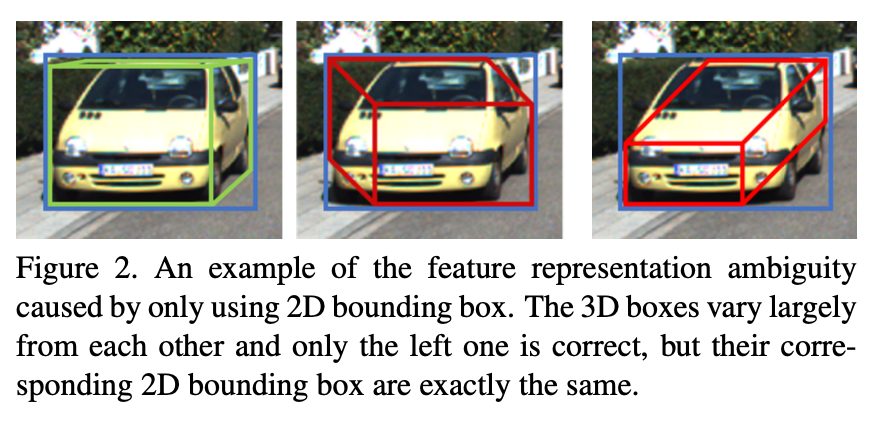

为了解决这个问题，作者提出了一种利用3D框在2D图上投影后的可视平面特征去恢复3D框的结构。

# Implementation
整个方法大致分为几个过程，首先是预测2D框和对应物体的角度，然后生成对应的3D框，并找到图像中对应的可视平面，最后根据可视平面内的特征对之前预测的3D框进行精调。过程如下

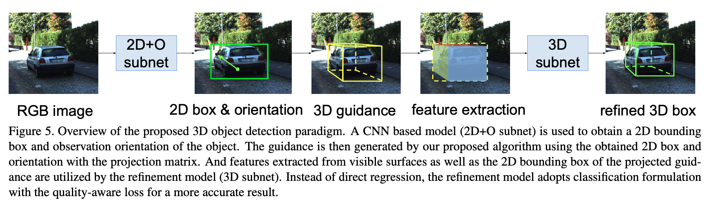

## 2D目标检测和角度回归
2D目标检测是基于Faster RCNN的框架，二维检测框和角度的预测分支如下图所示

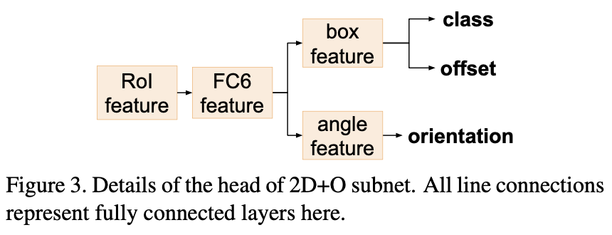

与之前的方法一样，角度的预测值都采用预测局部角度，示意图如下

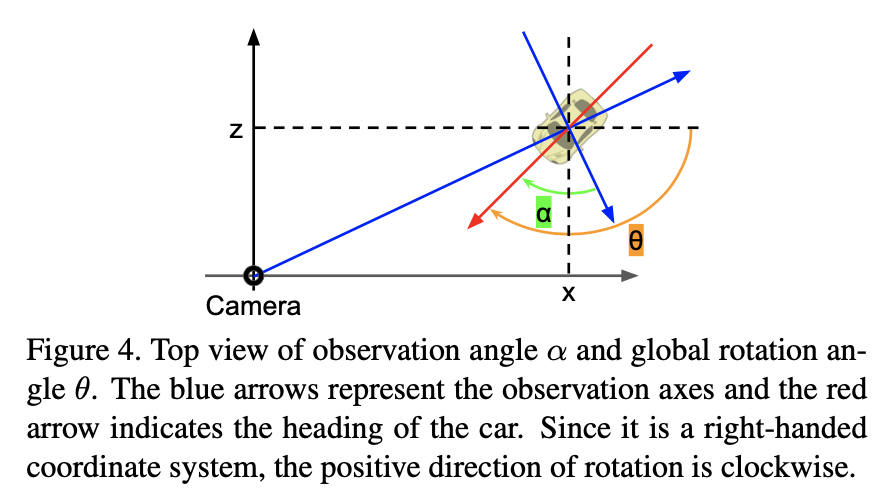

## 3D预选框的确定（Guidance Generation）
在自动驾驶场景中，相同类别物体之间的尺寸分布是单峰且方差小，因此作者采用每类物体的平均值作为3D预选框的尺寸，从而进一步估计预选框的位置。

有了3D框的尺寸，和投影后2D框的位置，这里就可以计算3D框的位置。作者采用的方法和之前基于线性方程组求解的方法不同，这里是采用相似变换的方法进行求解（高度）。这里是基于作者的一个观察，即三维物体中心在3D框上平面的中心点与3D框上边缘的中心点几乎是对应的，而三维物体中心在3D框下平面的中心点与3D框下边缘的中心点几乎是对应的（这里构成了一组相似三角形？）

假设检测出的2D框为 $x^{2d}, y^{2d}, w^{2d}, h^{2d}$，则2D框的上边缘中心点为 $M^{2d}_t = (x^{2d}, y^{2d}-h^{2d}/2)$ ，下边缘中心点为 $M^{2d}_{b} = (x^{2d}, y^{2d}+h^{2d}/2)$ 。对应的齐次坐标形式为 $C^{2d}_t = (M^{2d}_t, 1)$ ，$C^{2d}_b = (M^{2d}_b, 1) - (0, \lambda h^2d, 0)$ 其中 $\lambda$ from statistics on training data。则归一化后的3D坐标为（深度被归一化）

\[
\tilde{C_b} = K^{-1} C^{2d}_b , \tilde{C_t} = K^{-1} C^{2d}_t.
\]

如果深度 $d$ 已知，则
\[
C_b = d \tilde{C_b}
\]

因此，只要估计出来深度，则位置即可以得到。此时，根据估计的上下中心点位置可以计算出归一化后的高度 $\tilde{h} = \tilde{y_b} - \tilde{y_t}$ ，
而实际的高度为预选框的预设高度，因此可以估计出深度值。

全局角度的计算：
\[
\theta = \alpha + arctan \frac{x}{z}
\]

## 可视平面特征提取
这里将前面计算得到的3D框投影到图像上，计算相应的可视平面。

作者认为，在自动驾驶场景下，底部平面一般是不可视的，因此，选择顶部平面为可视平面；对于前后平面的选择，根据观察到的角度 $\alpha$ （预测角度），如果该角度大于0，则前平面可见，如果小于0，则后平面可见。如果该角度在 $[-pi/2, \pi/2]$ 之间，则右平面可见，否则，左平面可见。 该判断角度的范围为 $(-\pi, \pi]$ ，右手方向为0，顺时针为正。

确定完可视平面后，根据每个可视平面上的角点，提取对应特征图上的特征区域，并将其reshape成固定 $5 \times 5$ 大小的块作为下一阶段输入特征。

整个过程的示意图如下所示
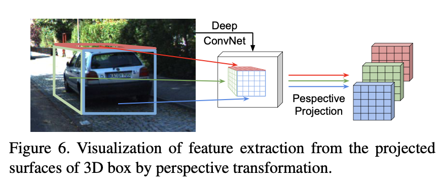

## 3D框精调
这部分是根据前面得到的2D框区域的全局特征以及3D框可视区域特征，对3D框进行进一步的回归，该部分网络解构如下所示

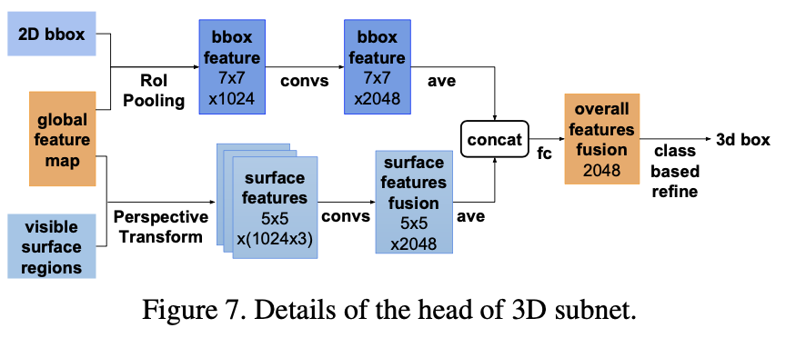

这里最后的输出是对3D框参数的回归量。

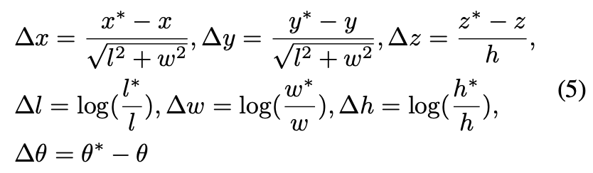
作者认为，分类任务要比回归任务更容易，因此，这里将每个参数的回归都转换成先分类，再回归残差的形式。由于上一阶段产生的预选框也可能是背景框，这里对于背景框的处理是背景框在各个分段的目标概率都是0，在推理阶段，设置阈值来抑制背景框。

作者希望在这一阶段，预测的confidence可以反映对应类别与目标框的吻合程度。但是仅仅是分类目标无法反映这个变量，因为落在同一个区域的预测值其目标值都相同。因此，作者修改了分类的目标值：

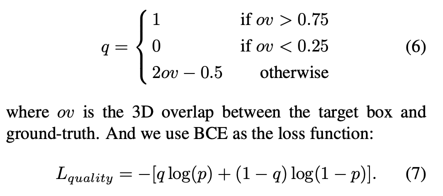

## 参数设置
实验部分好像是只针对Car这个类别进行了测试。
$\bar{w} = 1.62, \bar{h} = 1.53, \bar{l} = 3.89, \lambda=0.07$

微调阶段
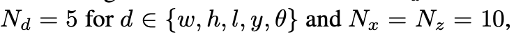

## 实验结果
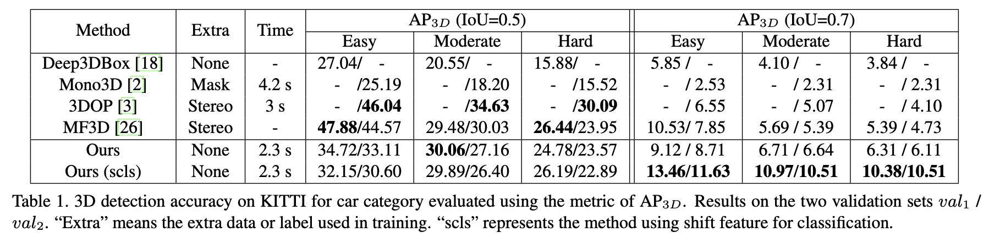
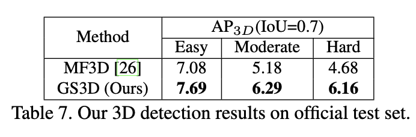
