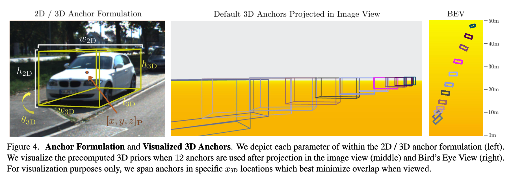

# M3D-RPN论文解析
这是密歇根州立大学发表在ICCV 2019上的工作。

# Motivation
现阶段很多单目3D检测方法要不就是需要额外的数据，例如车辆模型等；要不就是分成多阶段，先进行2D检测然后再进行3D检测。

作者认为2D检测和3D检测可以在一个统一的框架网络里完成，并且2D检测可以很好的引导和提升3D检测的性能。
因此，作者提出了一种单目3D proposal network。

# Implementation
实现过程大致分为3步：首先是生成一系列锚框，然后通过网络对这些锚框进行筛选和回归，最后通过后处理对筛选出并预测回归的预选框进行优化。

## 锚框设置
因为作者的目标是使网络同时进行2D和3D检测，因此，作者在这里设置锚框时，2D框和3D框的参数同时考虑 $[w, h]_{2D}, z_p, [w, h, l, \theta]_{3D}$。
2D框的位置是3D框的位置通过投影变换得到的。（2D框的尺寸是不是也是3D框投影得到？）

作者会为每个预选框设置 $z_p$ 和 $[w, h, l, \theta]$ （如何设置？，x,y怎么考虑？），在回归时，考虑这些预选框在图像上的投影与真值框的交并比大于0.5的候选框进行回归。

（3D预选框设置仍然比较迷....）

## 3D检测
这部分是主要的M3D-RPN网络结构部分，如下图所示

这里作者考虑到不同深度上特征之间参数是有差异性的，现有的常规卷积操作的权重共享弱化了这种差异性。因此，提出了一种depth-aware的卷积操作，具体表现先对特征图上的特征在高度维上对特征进行组划分，然后对于不同组，采用不同的卷积核。

最后通过加权平均的方式将正常卷积特征与这种深度卷积特征进行融合。权重是可学的？还是网络输出？

网络的输出向量为 $m \times n \times 12$， 其中12是指 $c, [t_x, t_y, t_w, t_h]_{2D}, [t_x, t_y, t_z]_P, [t_w, t_h, t_l, t_{\theta}]$

## 角度优化

## 实验结果

