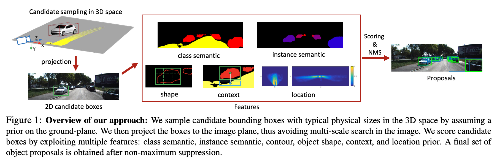
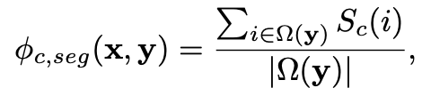

# Monocular 3D Object Detection for Autonomous Driving 论文分析
这是清华大学马慧敏老师课题组Xiaozhi Chen和多伦多大学合作发表在CVPR 2016上的工作。

# Motivation
通过在三维空间中穷举候选框，然后通过设计标准，筛选这些候选框，类似于2D中的目标检测过程。

# Implementation
算法的整个过程如下图所示

首先从三维空间中生成候选框，并投影到图片上，确定候选区域，然后通过设计的一系列特征，确定候选区域的质量，最终筛选出合适的3D框。

## 候选框生成过程
首选需要确定相机坐标系下的地平面，从该平面上遍历选择3D框。对于每类（车辆，行人，自行车）设置3个不同尺寸和2种不同角度（0，90）的候选框。

## 候选框评估
生成候选框之后，需要对这些框进行筛选。作者在文中采用语义分割，形状，实例分割，纹理，以及位置几个方面对候选框进行评价。

### 语义分割
这部分是对整个图像进行语义分割，然后统计当前候选框区域内的两个指标，一个指标分割目标的像素占整个候选框的比例

另一个指标是分割出的其他类别所占比例

（这里的其他类别不包含背景？，如果包含，采用1- $\psi$的形式应该就可以了）

### 形状
这部分是主要根据物体轮廓来计算相应指标。这里轮廓的计算是在分割结果的基础上进行的。对于每个候选2D框，生成两种cell：一种只包含一个cell，它覆盖了整个2D框，另一种是将2D框划分成 $K \times K$ 个cell。对于这两类cell，统计每个cell内包含的轮廓像素点个数，最终生成长度为(1+KxK)的向量。

### 实例分割
这个部分只对车这个类别进行了计算。这部分是计算分割示例在2D框内与不在框内的像素比例。应该是只计算示例分割结果与2D框交并比最大的实例分割结果。

### 纹理
纹理部分是指将2D框区域进行一定程度上的扩大（长宽的三分之一），并使用CNN提取特征。

### 位置
通过在俯视图上和图像上设置位置先验，并使用网络进行学习，位置先验学习是采用核密度估计（KDE）。

最后，将所有的指标进行加权平均

## 参数设置和训练过程
方法中涉及很多部分，训练过程应该比较困难，推理速度应该很慢。
