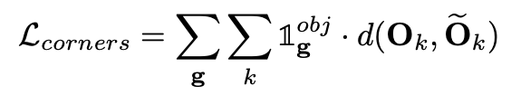

# MonoGRNet 论文解析
这篇文章是清华大学的Zengyi Qin和微软研究院合作发表在AAAI 2019上的工作。名字起的很虎人，
A Geometric Reasoning Network for Monocular 3D Object Localization, 感觉内容
里并没有比较显著的几何推理。

# Motivation
单目3D检测由于深度信息的丢失，导致搜索空间大，以及引入了2D恢复3D时的奇异性，这都导致3D检测任务
是非常困难的事情。之前有工作是通过预测整张图像的深度，由于检测目标在图像中所占比例比较小，对整张
图的深度进行优化时，被检测物体上的深度可能会被一定程度上忽略。

作者将单目3D检测任务分解成几个子任务，每个子任务都可以通过单目的信息得以解决。对于深度估计问题，
作者只针对被检测物体进行深度估计，并以此为基础，构建了整个网络。

# Implementation
作者将单目3D检测任务分成4个子任务：2D检测，实例深度估计，3D位置估计，顶点回归，
其中是以物体的深度估计为基础，各个任务在网络中的实现关系
如下图所示。

## 2D目标检测
2D检测几乎是所有3D目标检测的基础（当然还有一些是直接采用3D空间的预选框，然后进行筛选的），
作者在这里也是采用了VGG-16作为特征提取网络，采用KittiBox检测结构进行快速的2D目标检测。
输出的结果为 $S_x \times S_y \times 5$ 的张量。5维向量的输出维 $Pr_{obj}, \delta_{x_b}, \delta_{y_b}, w, h$ 。

2D检测结果的输出用于后续的ROIAlign的输入，提取浅层的物体特征。

## 实例深度估计（instance depth estimation, IDE）
作者这里考虑到全局深度估计的会一定程度上忽略目标物体的深度，此外，全局深度估计需要整张图像的深度
作为训练标签，这里作者采用只估计目标物体实例的深度，标签的定义如图所示

在实现实例目标深度估计的过程中，采用了不同尺度的特征，作者使用感受野更大的深度特征估计一个粗略的
范围，作者任务这种特征对目标的位置不是特别敏感。此外，采用浅层分辨率更高的特征预测该粗略深度与
真实深度的差值。作者任务这种特征对目标位置更敏感。最终综合两种结果用于预测目标深度，实现过程如
图所示

## 3D位置回归
一般来讲，三维物体的中心位置和2D框的中心位置是不对应的，因此，这里先对投影后的中心位置进行回归，
根据回归的像素坐标以及之前估计的深度和已知的相机内参，计算粗略的物体三维空间位置。由于中心回归和
深度估计都存在误差，这里作者也对误差进行了进一步的估计。最终对每个物体都估计出一个比较好的3D位置。

## 3D框顶点回归
位置虽然知道了，但是不知道朝向和物体的实际尺寸，这里存在两种方法对其进行估计，一种是直接估计朝向和
尺寸的参数，一种是对顶点进行估计。这里采用对物体坐标下局部顶点位置进行估计，如图所示

最后，采用 $O^{cam}_k = R O_k + C$ 计算最终八个顶点的位置。（ $R$ 是怎么得到的？）

## 损失函数
作者针对不同的任务设置了不同的损失函数。
对于2D目标检测任务采用交叉熵分类损失和L1回归损失

对于实例目标深度估计，针对两个预测值，分布设置损失函数进行学习

对于3D定位损失，也包含两个部分

对于顶点的回归损失

总的损失函数为

## 参数设置和训练过程
$w = \alpha = \beta = 10$ ，模型权重正则化对应的参数为 $10^{-5}$ 。对于不同的模型，
作者分布进行了训练。首先采用Adam训练器，迭代120K代学习2D检测器。
然后训练80K代训练IDE，3D位置估计和顶点估计。最后采用SGD迭代40代对整个网络进行训练。
训练过程中batch-size为5，学习率为 $10^{-5}$ 。

## 实验结果

可以发现，尺寸的估计误差集中在长度上，位置的估计误差集中在深度上。
