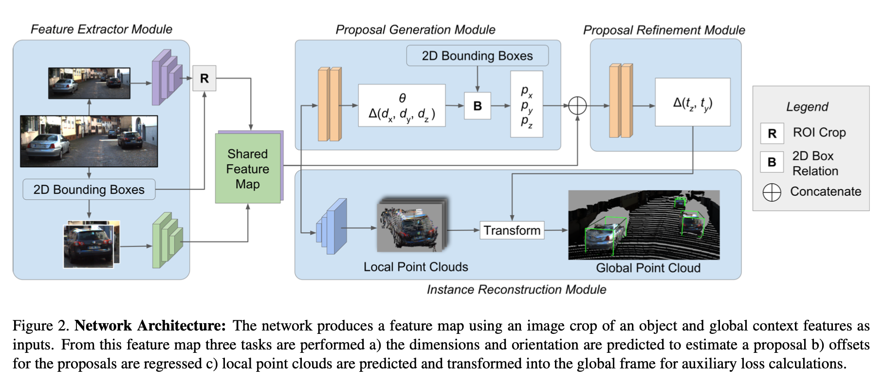
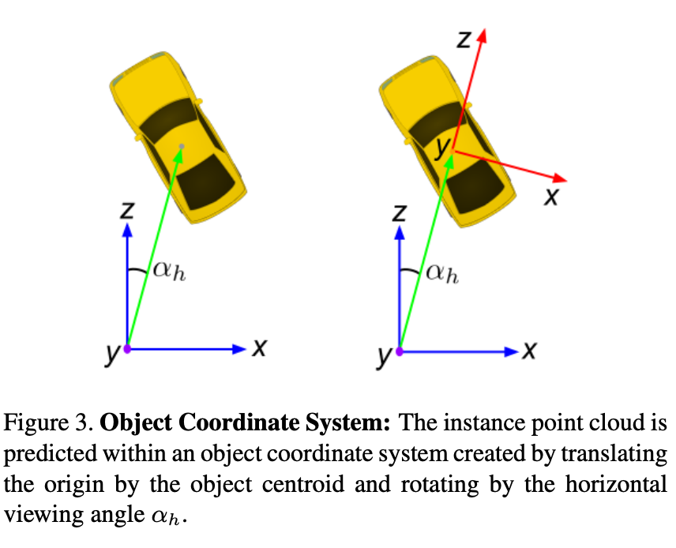
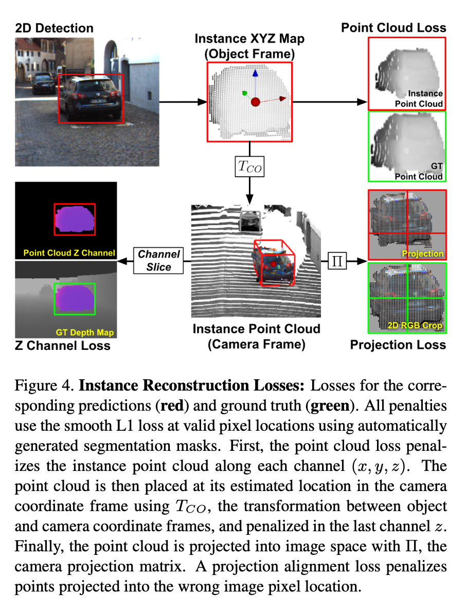

# MonoPSR 论文分析
这是多伦多大学Jason Ku等人发表在CVPR 2019上的工作。

# Motivation
由于图像在成像的过程中丢失了深度信息，单目3D检测因此成为一件比较困难的事情。为了解决这个
under-constrained的问题，近几年除了几类方法。其中一类是假设3D框在图像上的投影与在图像上
检测到的2D框是完全吻合的，因此可以通过2D检测框，物体的尺寸和朝向估计，恢复物体的三维空间位置。
但是这种方法的问题在于对2D框的估计误差，尺寸和朝向估计误差比较大的影响3D位置的估计。
另一类方法是借助车辆模型，将车辆模型与图像中的检测区域匹配，确定物体的姿态。但是这类方法往往
受到车辆模型的限制，实际中很多车可能之前并没有模型。

针对第一类方法存在的问题，作者引入形状恢复的任务，作者任务该任务有助于估计目标物体更精确的位置和
姿态，并且对2D估计结果的精度不敏感。

# Implementation
算法的核心在于对每个物体生成一个高质量的预选框以减少搜索空间，然后采用形状重建任务辅助完成
更精确的位置估计。
该方法包括3个模块：预选框生成，预选框微调和实例重建。三部分之间的关系如下图所示

## 预选框生成（Proposal Generation）
这部分需要根据图像生成2D检测框，并估计每个检测框内物体的尺寸和朝向。这里尺寸和朝向的估计也是采用
先分类再回归的方式。分类标签由聚类方法得到，回归目标是真值到所属类别聚类中心的距离。

为了得到从2D框中得到3D的预选框，需要对深度进行恢复，作者考虑到如果采用之前最小二乘的方法计算物体
3D位置会对2D框的估计误差和尺寸朝向估计误差敏感，因此，这里作者采用高度的透视相似变化，根据估计的
实际高度值2D检测框的高度，以及相机焦距，可以恢复深度。
\[
t_z = f \frac{h}{\hat{h}}
\]
其中 $t_z$ 是估计的三维物体中心到相机平面的深度，$h$ 是估计的实际高度。

x, y坐标的估计是根据该深度值以及2D目标检测的中心坐标进行反投影变换得到。（这里有一个问题，2D
目标的中心与3D目标的中心很多情况下是不重合的。）

## 预选框微调（Proposal Refinement）
上一步估计的深度会受很多因素的影响，例如物体实际尺寸的估计，2D框的精度，视角等。因此，更精确的
深度估计可以表达如下：
\[
t_x = f \frac{d_y}{b_h} + s(\theta, \phi, \psi, D, \alpha_v, \alpha_h)
\]

因此，作者这里对式中的 $s$ 误差项进行了预测，这里只是输出两个方向上的预测 $\Delta t_y, \Delta t_z$ ，
而是采用视角的方式计算 $t_x$ 。（视角是怎么计算？根据2D框的中心坐标？如果是，这个视角并不是
3D中心点的视角，距离越近，这个视角误差会越大）

## 实例重建（Instance Reconstruction）
这里的实例重建实际是指物体上激光雷达点的坐标。由于点云的稀疏性和分布不均匀性，激光雷达在每个物体
上的点个数是不同的，因此，作者先采用一种插值的方法对点云进行上采样。通过将3D框内的激光雷达点投影
到图像上，从而得到实例分割的标签，以及三维点标签，
这个坐标是一被检测物体为中心的局部坐标系，坐标系示意图如下

这部分只在训练的过程中使用，在推理过程中并不会使用。

## 损失函数
总的损失函数包括4个部分
\[
L_total = L_t + L_{\theta} + L_{dim} + L_c
\]
分别对应中心回归损失，角度回归损失，维度回归损失和实例重建损失。
其中角度回归损失是采用先分类再回归的方法。

实例重建损失包含三部分，一部分是每个像素点分类损失，一部分是有效像素点的局部深度回归损失，
还有一部分是有效像素点的全局坐标的重投影误差损失。示意图如下

