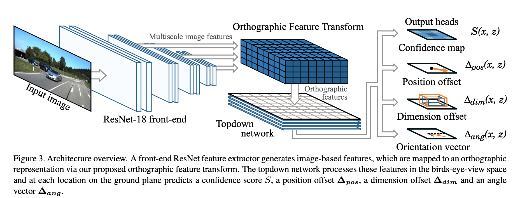
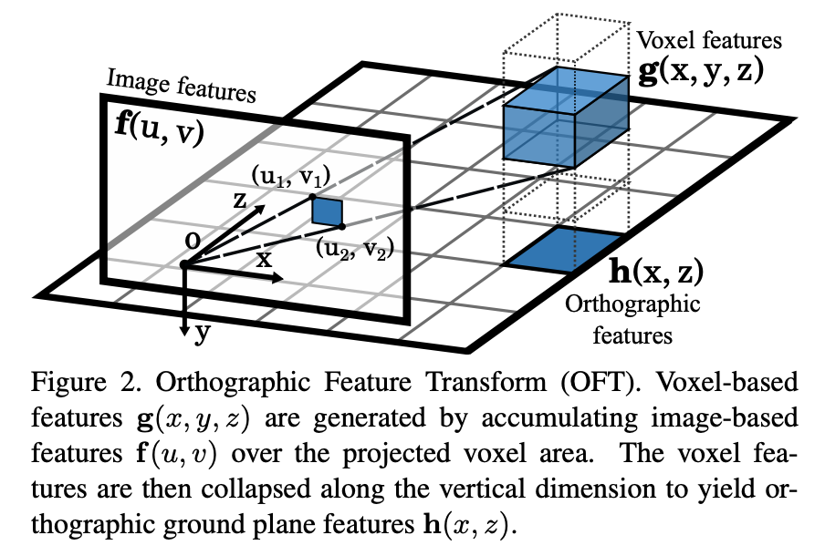
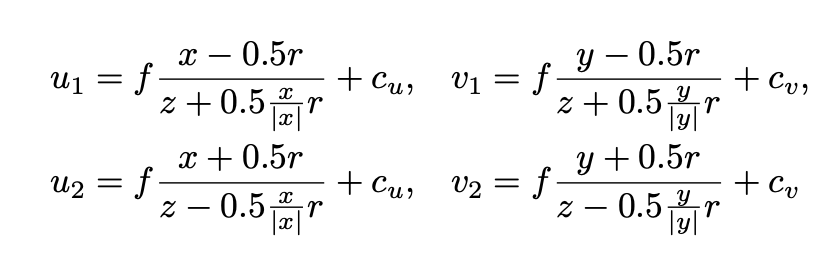
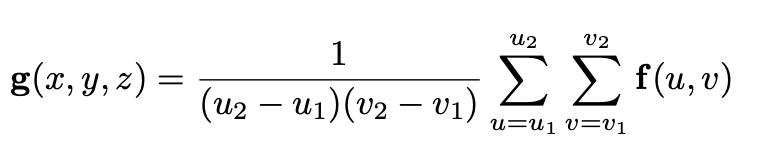
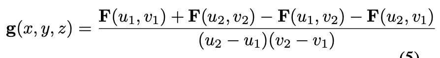

# OFTNet 论文解读
这篇文章是剑桥大学的一个工作，不知道发表在什么地方...

# Motivation
作者认为，现有的大部分方法是基于perspective image-based表示的方法做的，这种方法的问题在于物体的外观和尺度都会随深度的和有效距离的不同而大大不同。作者任务，在3D世界中的推理能力是实现3D目标检测的基础。因此，作者提出了正交特征变换，将image-based特征转换到正交的3D空间中实现3D检测任务。

# Implementation
整个方法实现包括4个部分。如下图所示

## 正交特征变换（Orthographic feature transform）
正交特征变换的原理比较简单，即通过相机的内参，建立图像空间与正交3D空间的映射关系，具体过程如图所示

对于正交3D空间中位于 $(x, y, z)$ 位置的体素，其对应的图像空间的区域为

由于体素对应的往往是一个区域，需要将该区域的特征进行综合，从而得到体素对应的特征

作者认为按照这种方式计算比较低效，因此，上述公式进行转换

