# SHIFT R-CNN 论文分析
这是Andretti Naiden等人发表在ICIP2019上的工作。

# Motivation
目前主流的单目3D检测的方法是根据预测的3D框的尺寸，用最小二乘对位姿进行计算求解。这种精确求解的
方法会使求解结果对2D框结果以及估计的3D尺寸敏感，从而导致求解的误差。为了缓解这种误差，作者提出
了一种3阶段单目3D检测方法。在最小二乘估计的基础上，再进行预测微调。

#Implementation
前面也提到，整个方法包含3个阶段，如下图所示

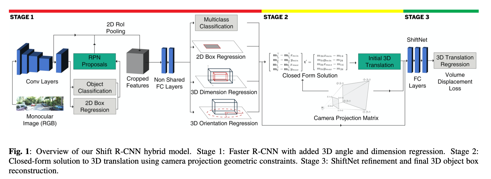

## 第一阶段：2D目标检测和物体尺寸估计
这一阶段采用Faster-RCNN结构，提取2D候选框，并根据框内特征，对框内物体的朝向和实际尺寸进行预测。

### 角度预测
在角度预测时，与之前的方法相似，都是预测局部角度，不同于之前方法中直接预测角度值的做法，这里是采
用预测角度正弦值 $\hat{sin_{\alpha_L}}$ 和余弦值 $\hat{cos_{\alpha_L}}$ 的方法。
当然，这里也是采用先分类再回归的方式处理角度预测。网络训练时采用的损失函数为

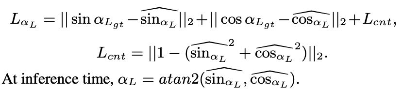

### 物体尺寸预测
在物体尺寸预测时，也是采用先分类再回归的方式。预测目标如下
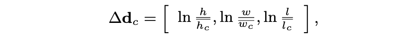

在推理时，需要根据预测量恢复出预测尺寸，计算方式如下
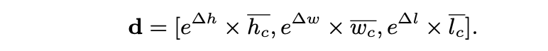

则这一阶段的损失函数为
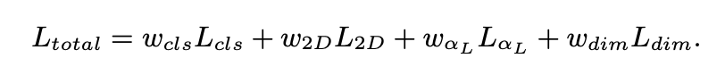

## 第二阶段：估计物体的三维位置
首先需要从图像视角下的局部角度估计转换成车体坐标系的全局角度，此次需要计算车体中心点与当前车辆
位置形成的夹角。则全局角度为
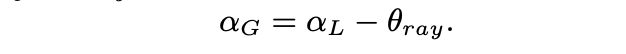

然后需要根据估计的3D框尺寸与2D框在图像中的位置，找到3D框中与2D框对应的4个点，从而利用最小二乘
求解3D框在车体坐标系下的位置。
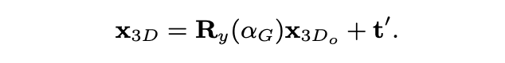
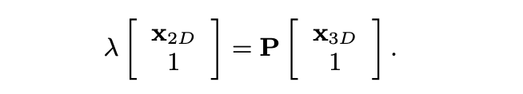
将其展开并整理形式
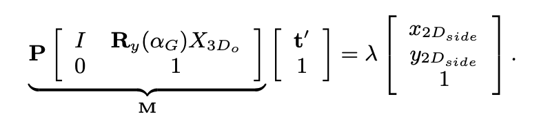
将 $\lambda$ 消除，得
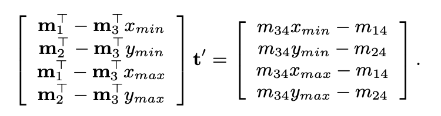

## 第三阶段：微调位置估计结果
作者发现，由于假设2D估计结果是完全精确的，但是在实际中是有误差的，因此，在最小二乘的求解结果会被
影响。通过测试实验发现，这种影响是比较大的，作者这里对求解的位置进行进一步微调。采用一个两层的MLP
，网络的输入为：第二阶段估计的位置 $t'$ ，第一阶段估计的2D框的位置 $b_{2D}$ ，车的实际尺寸 $d$ ，
局部角度的三角函数估计 $(sin(\alpha_L), cos(\alpha_L))$ ，实际角度的三角函数估计，和投影矩阵
 $P$ 。输出为三个方向的平移量。

 在对该部分估计结果计算损失时，作者考虑到，如果直接采用L1或L2损失，则隐含的假设为不同方向（坐标轴）上
 的相同平移量对最终结果造成的影响是相同的，但是在实际中，这种假设存在一些问题。例如，y轴方向和x
 轴方向相同的平移量对交并比的影响非常大。因此，这里考虑了一种Volume Displacement Loss，即对
 不同方向上的损失进行加权，权重为与当前方向垂直的平面面积（其实乘起来之后就是偏移出去的体积）。
 考虑到目前估计的结果是在车体坐标系下三轴方向平移量，需要转到当前目标坐标系下乘积才有意义
 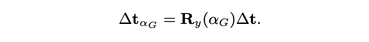

则该部分的损失函数为

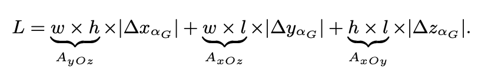
