# 3D BoNet 论文分析
这是牛津大学杨波和DeepMind一起搞的发表在NeurIPS2019上的工作。

# Motivation
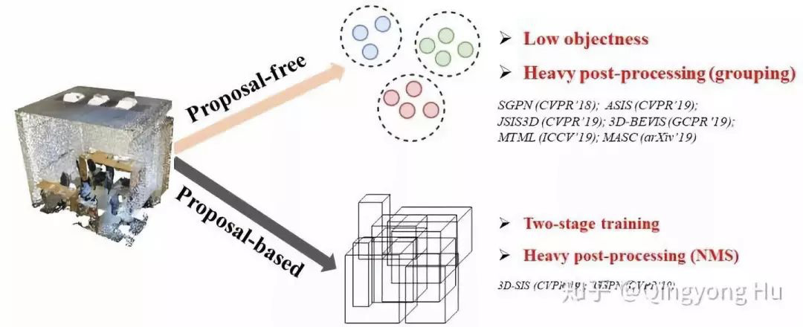
如下图所示，当前主流的点云实例分割算法可以分为以下两类：

1. 基于候选目标框(Proposal-based methods)的算法，例如3D-SIS[1]，GSPN[2]，
这类方法通常依赖于两阶段的训练(two-stage training)和昂贵的非极大值抑制(non-maximum suppression, NMS)
等操作来对密集的proposal进行选择。

2. 无候选目标框的算法(Proposal-free methods)，例如SGPN[3], ASIS[4], JSIS3D[5], MASC[6], 3D-BEVIS[7]等。
这类算法的核心思想是为每个点学习一个discriminative feature embedding，
然后再通过诸如mean-shift等聚类(clustering)方法来将同一个instance的点聚集(group)到一起。
这类方法的问题在于最终聚类到一起的instance目标性(objectness)比较差。
此外，此类方法后处理步骤(post-processing)的时间成本通常较高。

不同于上述两类方法，论文中提出了一个single stage, anchor free并且end-to-end的基于边界框回归的实例分割算法(3D-BoNet)。该算法具有如下优势：

1. 相比于proposal-free的方法，3D-BoNet显式地去预测目标的边界框，因此最终学到的instance具有更好的目标性(high objectness).

2. 相比于proposal-based的方法，3D-BoNet并不需要复杂耗时的region proposal network以及ROIAlign等操作，
因此也不需要NMS等post-processing步骤。
3D-BoNet由非常高效的shared MLP组成，并且不需要诸如非极大值抑制，特征采样(feature sampling)，
聚类(clustering)或者投票(voting)等后处理步骤，因此非常高效。

# Implementation
3D-BoNet的总体框架如下图所示，它主要由1) Instance-level bounding box prediction；2) Point-level mask prediction两个分支组成。bounding box prediction分支用于预测点云中每个实例的边界框，mask prediction分支用于为边界框内的点预测一个mask，进一步区分边界框内的点是属于instance还是背景。

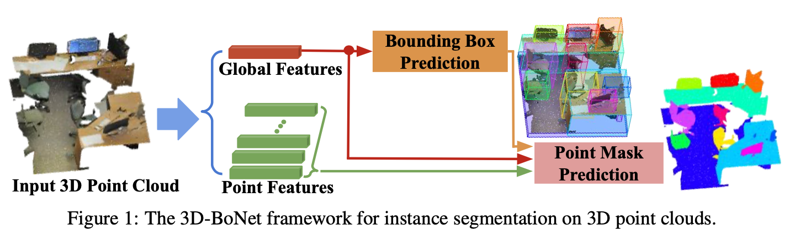

## Instance-level bounding box prediction
Bounding box预测分支使用global feature直接回归固定个数的bounding boxes。每个box预测两个点共六个变量（ ${[x_{min}, y_{min}, z_{min}], [x_{max}, y_{max}, z_{max}]}$ ），这与自动驾驶场景中的3D box的表示有所不同，这里并没有考虑框的朝向。该预测部分的结构如下图所示

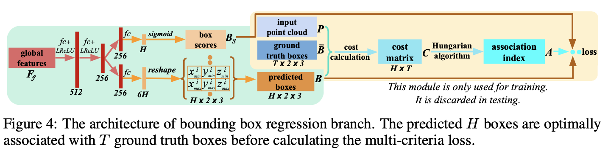

如果直接回归固定个数的Boxes,由于每帧点云中实际存在的物体个数是不一样的，并且排列顺序与预测的顺序也是不一样的，因此，预测的Box与真值Box是不能直接对应的。为了找到预测值与真值的匹配关系，作者这里将其定义为最优匹配问题，其形式如下：

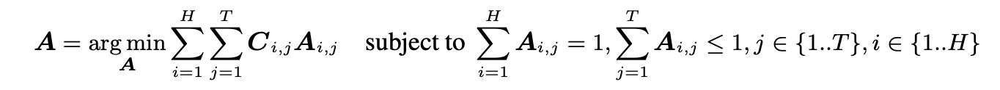

其中 $A$ 为关联矩阵，$A_{i,j}=1$ 表示第i个预测框与第j个真值框关联。第一个约束表示每个真值框有且只有一个预测框与之对应，第二个约束表示每个预测框，至多只有一个真值框与之对应（也可能没有）。 $C$ 为关联代价矩阵，$C_{i,j}$ 表示两个框之间的相似性。如果要求解上述问题中的关联矩阵，关联代价矩阵的确定是至关重要的，作者这里认为，关联代价矩阵应该包括3个部分。

1. 两个框两个对顶点之间的距离：

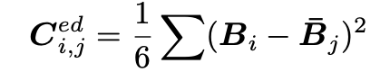

2. Soft Intersection-over-Union on Points. 计算这部分的关键在于计算一个指示矩阵 $q$ ，其中 $q_i \in R^N$ 表示整个点云属于第i个预测框的概率向量。计算方式如下：
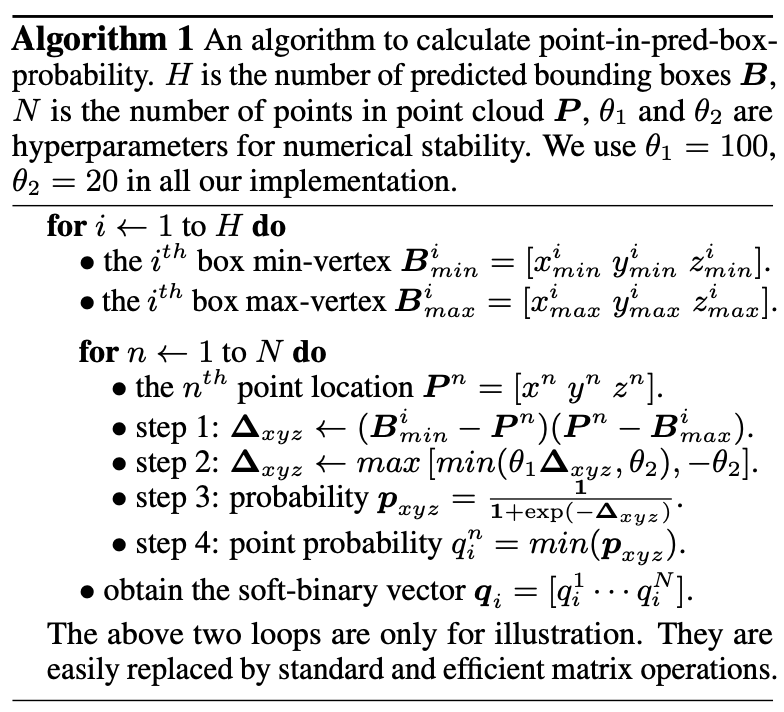
最后sIoU的计算如下：
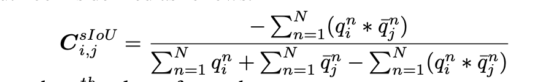

3. 交叉熵

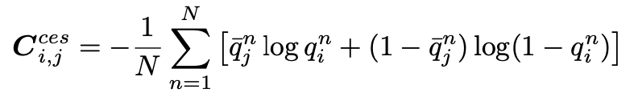

交叉熵倾向于得到更大且具有更高覆盖率的边界框。

### 损失函数
在通过边界框关联层之后，我们使用关联索引矩阵 $A$ 对预测边界框 $B$ 及其对应分数 $B_s$ 与groundtruth进行匹配，使得靠前的 $T$ 个边界框(ground truth的总边界框数)及与ground truth的边界框能匹配上。框的预测有两个分支，一个是回归一个是分类。

1. 针对边界框预测采用了多准则损失函数，也即三者求和
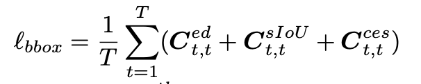

2. 针对边界框分数预测我们采用了另外一个损失函数。预测框分数旨在表征相应预测框的有效性。在通过关联索引矩阵$A$重新排序以后，我们设定前$T$个真实的边界框对应的分数为1，剩余的无效的$H-T$个边界框对应的分数为 0。我们对这个二元分类任务使用交叉熵损失

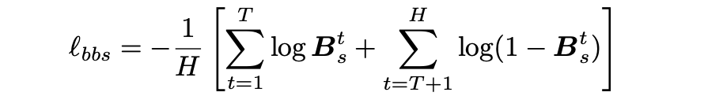

## Point Mask Prediction
相比于bounding box prediction分支，这个分支就相对简单很多了,因为只要边界框预测的足够好，这个分支就相当于做一个二值分类问题，即便瞎猜也能有50%正确率。在这个分支中，作者将点的特征点与每个边界框和分数融合在一起，随后为每一个实例预测一个点级别的二值mask。考虑到背景点与实例点数的不平衡，作者采用focal loss[10] 对这个分支进行优化。
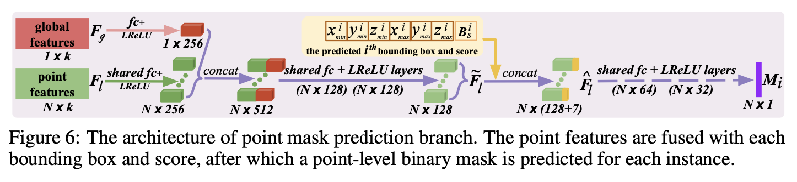
