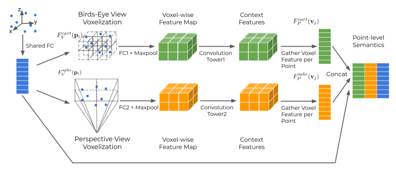
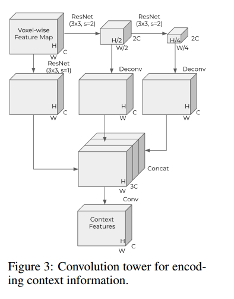
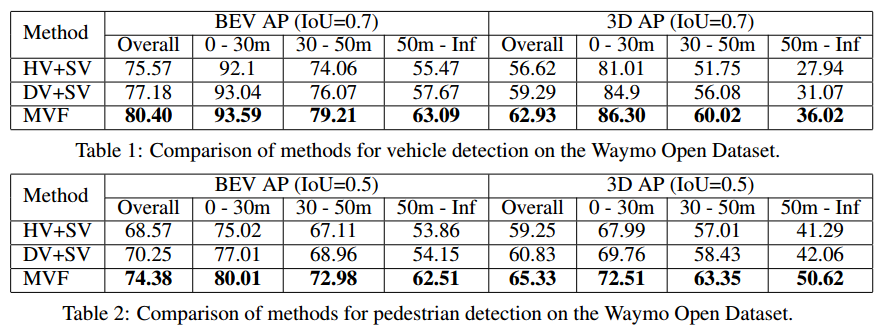
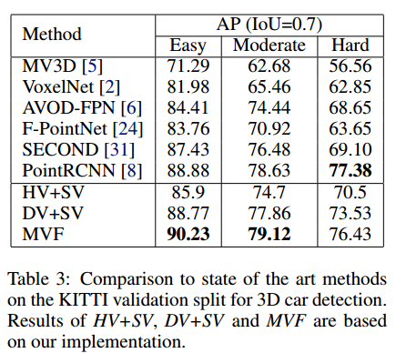

# MVF(Multi-View Fusion) 论文分析

这是Waymo 和谷歌大脑2019年发表在CoRL上的工作。

# Motivation
目前很多基于点云进行3D检测的工作是基于voxel的方式进行的，大致分为两大类，
一类是最后在俯视投影图上进行3D框的预测，另一类是在前视投影图上进行3D框的预测。
这两种方式都有各自的优劣。
基于俯视投影图可以使物体之间很自然的分开，保持合理的物理维度
但是远处与近处物体上点的密度相差非常大，对于远处物体和小物体（行人，交通灯等）的检测
非常困难。
基于前视投影图时，点云前视视角成像比较稠密，对于行人的检测会比较友好。
因此，作者考虑综合两个视角下的特征进行物体检测。

此外，针对之前体素化的方式，基本是采用每帧点云固定个数的体素，每个体素内固定个数的点。
对于多于或少于固定值时，则采用降采用或过采用的方式进行处理。
作者认为，这种方式既可能会丢失信息，又可能会浪费计算量，
此外，这种采样对样本进行扰动可能会使输出的检测结果不太稳定，因此，作者提出了动态体素化
方法。

# Implementation
整个文章着重介绍多视角融合，并没仔细的讲融合后的特征是怎么用于做3D检测的。
融合的整个过程如下图所示。

## 动态体素化
体素的构建关键在于要建立两个关系，即点到体素的映射关系和体素到点的映射关系。
\[
F_V(p_i) = v_j, \forall i \\
F_P(v_j) = \{p_i | \forall p_i \in v_j \}, \forall v_j
\]

这里不同于VoxelNet以及SECOND等之前那种固定体素化（Hard Voxelization）的方式，因为这里不采用VFE这种结构提取voxel的特征，而是使用FC+MaxPooling提取voxel内特征。

文中是采用了两个视角方向的体素化。分布采用笛卡尔坐标系和球坐标系。其中，球坐标系的坐标计算方式为
\[
\{ (\phi_i, \theta_i, d_i) | \phi_i = \arctan(\frac{y_i}{x_i}), \theta_i = \arccos(\frac{z_i}{d_i}),
d_i = \sqrt{x^2_i+y^2_i+z^2_i} \}
\]

## 特征提取
采用ResNet对不同视角的特征进行多尺度提取，与之前VoxelNet,SECOND中的RPN阶段有点像。
具体如下图所示：

（这里其实有点疑问，文中介绍的特征提取都是针对2D特征，然后采用2D卷积进行特征提取，
但是正常来讲体素化后的特征应该是3D（x,y,z三个方向）的，而且这里并没有介绍体素化时的具体参数。）

## 预测
文中没有介绍预测部分具体是怎么做的，例如预选框是怎么设置的，在哪个空间设置的（俯视投影空间？前视空间？原始点云空间？）

## 损失函数
采用和SECOND相同的损失函数。

## 训练过程
采用Adam，训练100ephochs，初始学习率设置为 $1.33 \times 10^{-3}$，采用cosine的学习率下降方式，第一个epoch之后，学习率达到 $1.5 \times 10^{-3}$。

# 实验结果

在KITTI上的结果只是在验证集上的结果，没有测试集上的结果。
