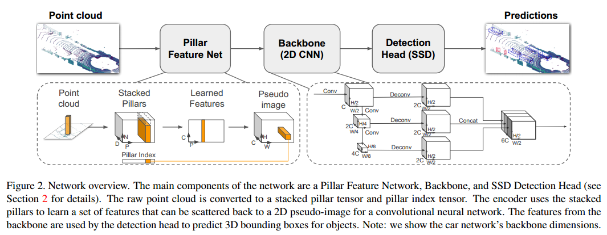
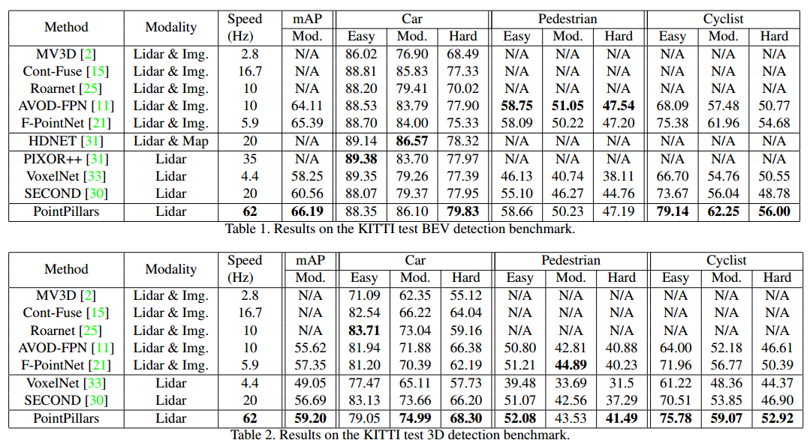
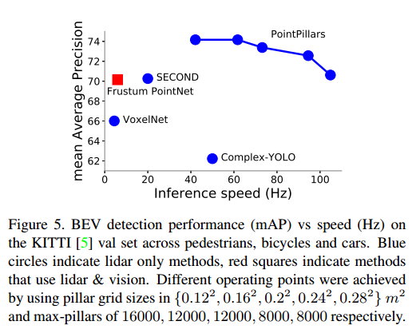
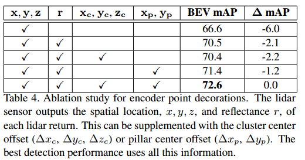
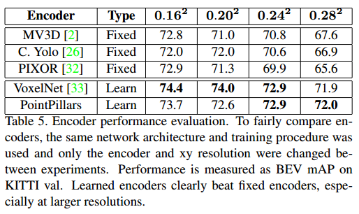

# PointPillars论文分析
这个是MIT的一个创业公司nuTonomy发表在CVPR 2019上的一个方法。

## Motivation
VoxelNet性能不错，但是有3D convolution，SECOND对其使用sparse convolution进行改进，但是仍然有3D卷积。本文采用pillars代替voxels从而丢弃3D卷积操作。

## Implementation
与VoxelNet，SECOND很相似，都有明显的三个阶段，如下图所示。

### Pillar Feature Network
这一阶段主要是将点云用pillars划分，并用PointNet提取特征。这个阶段可以分成4步：

1. Pillars划分。这一步主要使用pillars将点云空间中的x-y平面划分成柱状网格，划分后每个柱状网格内的点的属性有9个维度（原始坐标（x,y,z），反射强度r，相对于柱状栅格内中心点的相对坐标（$x_c, y_c, z_c$），相对于当前pillar中心点坐标（$y_p, y_p$））。

2. Pillars堆叠。由于点云的稀疏性和分布不均匀性，导致很多pillars内没有点。为了节省计算时间和存储空间，可以只对非空的pillar进行计算，则每帧点云中非空pillar的个数为 $P$，每个pillar内点的个数为 $N$，每个点的输入特征维度为 $D$，则当前的稀疏点云可以堆叠成稠密的张量形式，该张量的维度为 $D \times P \times N$。实际情况中，每帧点云的非空pillars个数都不相同，而每个pillar之间所含的点个数也是不同的，因此，需要对多的样本进行采样，对于少的采用0进行补全。

3. Pillar的特征提取。这里采用的PointNet的简化形式，使用FC-BN-ReLU生成 $C \times P \times N$ 的特征，然后再用MaxPooling对Pillar内部 $N$ 个点的特征聚合，得到 $C \times P$ 的特征。

4. 2D特征恢复。需要把 $C \times P$ 的特征按照空间索引位置，恢复成 $C \times H \times W$ 的2D特征，这里需要每个pillar对应的空间位置。

### Backbone 特征提取网络
这里和VoxelNet，SECOND中RPN的2D版本非常相似。

### Detection Head
基本和SECOND一致。

### 损失函数
和SECOND一致。

### 数据增广
采用SECOND中的方式，具体参数有差异。

1. 在采样真值框的过程中，对于每类每次选择插入的真值框个数不同。Car, Pedestrian和Cyclist分别对应15，0，8。

2. 每个真值框的旋转扰动范围是 $[-\pi/20, \pi/20]$，位置扰动分布为 $N(0, 0.25)$。

3. 每帧点云的旋转和缩放扰动与SECOND相同，此外增加x轴方向的随机翻转，对整个点云的位置进行平移扰动，分布为 $N(0,0.2)$。

### 参数选择和训练过程
xy平面网格化的分辨率为0.16m，最大的pillars个数为12000，每个pillar内最多的点个数为100。预选框的尺寸选择与SECOND相同，角度也是两个0，90。在训练Car，正负样本的IoU阈值分别是0.6和0.45，其他两类对应的是0.5和0.35。
在推理过程中，非极大值抑制采用的IoU阈值为0.5。

## 实验结果

### 整体实验结果

### 消除实验

#### pillar尺寸对精度和速度的影响

#### 真值框增广对训练过程的影响
VoxelNet和SECOND都提倡对真值框进行增广，而这篇文章的结论是尽量避免对真值框增广，作者认为插入采样真值框缓解了额外对真值框增广的需求。

#### 输入点的属性对最后精度的影响

#### Encoding对最后精度的影响

