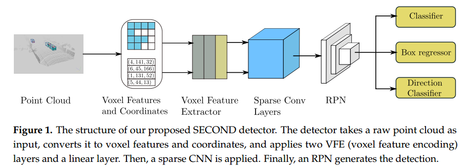
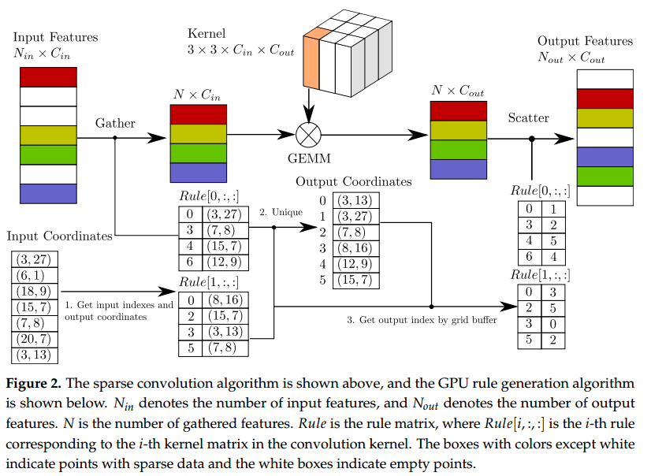
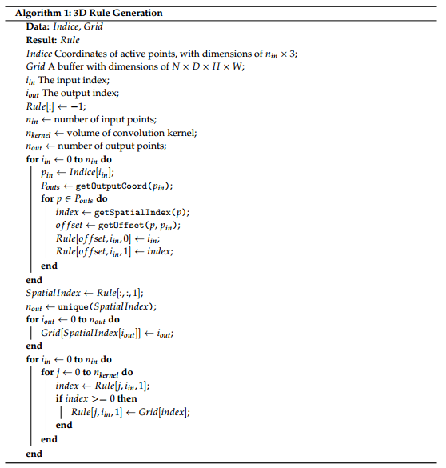
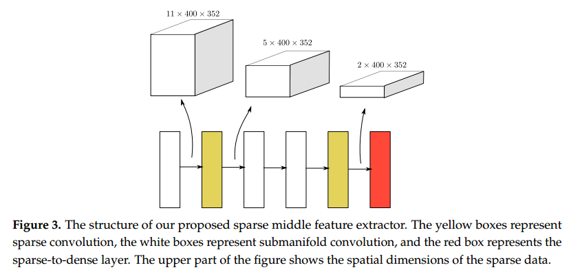
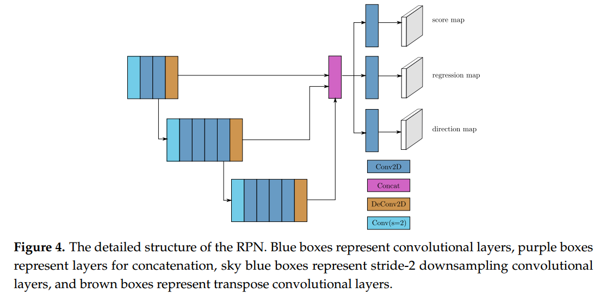
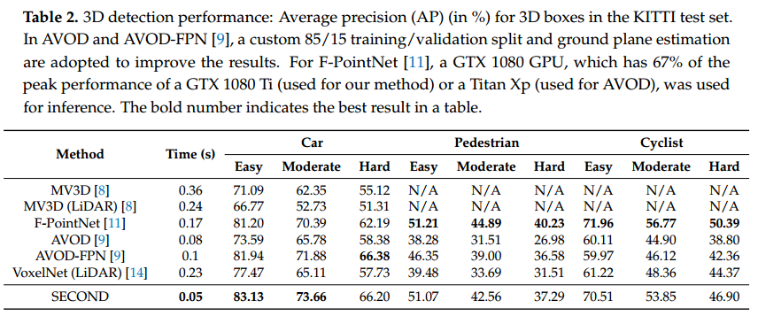
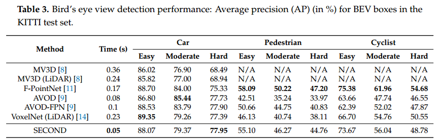

# SECOND论文分析
2018年Yan Yan, Yuxing Mao和Bo Li发表的对VoxelNet改进的文章。

## Motivation
动机很简单，VoxelNet速度太慢了，主要是3D卷积的速度慢。作者考虑引入稀疏卷积解决这个问题。

## Implementation
实现过程也包含三部分，和VoxelNet类似，不同的是用Sparse Conv Layers 替换掉 Middle Layers。

这里的sparse convolution的意思是，只在那些邻域非空的位置进行卷积计算，而对于当前位置响应值为0，邻域响应也是0的情况，不进行计算。和这个非常相似的另一个操作是submanifold conolution则对于自身响应为0，不管邻域是不是都是0，其响应值依然是0。submanifold convolution一定程度上避免了多层卷积之后会造成很多位置都有响应值，从而减小计算速度的现象。在激光雷达点云生成的voxel中，非空的比例非常小，从而正常的3D卷积会浪费大量的时间在0响应的voxel上，从而造成推理速度慢的问题。

这里的VFE部分与VoxelNet相同，不做过多解释。

### Sparse Convolution Middle Extractor
这部分的理解关键在于理解sparse convolution。
根据文中的表述，常用的2D稠密卷积可以表示为
\[
Y_{x,y,m} = \sum_{u,v \in P(x,y)} \sum_l W_{u-u_0, v-v_0, l, m}D_{u,v,l}
\]
其中W表示权重，D表示输入图像， $x,y$表示输出位置，$u-u_0, v-v_0$表示在卷积核中的相对位置。而通用矩阵乘法（GEMM: general matrix multiplication）的表示方式为：
\[
Y_{x,y,m} = \sum_l W_{*, l, m} D_{p(x,y), l}
\]
其中 $W_{*, l, m}$ 代表前面的 $W_{u-u_0, v-v_0, l, m}$ ,2D卷积的形式可以拉长成1D的形式。对于稀疏数据 $D_{i,l}$ 以及对应的输出相应$Y_{j,m}$，计算方式可以写成如下格式
\[
Y_{j,m} = \sum_{i \in P(j)} \sum_l W_{k,l,m} D_{i,l}
\]
其中，$l$ 表示特征维度，对于输出位置$j$，需要找到原图中的邻域$p(j)$，以及权重张量中对应的位置$k$所存储的向量，将其对应相乘，并从特征维度进行相加。该公式对应的GEMM形式为：
\[
Y_{j,m} = \sum_l W_{*,l,m}D_{p(j),l}
\]
这里的 $D_{p(j),l}$ 仍然包含很多0值（为什么*），为了解决这个问题，从上上面公式到上面公式的过程中，稍微改写一下：
\[
Y_{j,m} = \sum_k \sum_l W_{k,l,m} D_{R_{k,j}, k, l}
\]
其中 $R_{k,j}$ 做了一件事是对最后每个输出位置，都找到$k$个邻域，最后将这个个邻域里的向量进行相加，这个东西这里被叫做Rule。这个公式其实和上上面那个公式的形式非常像，只不过是多了个Rule。这个Rule对原来的D进行了分解，使其丢掉了0值，从而计算效率更高。Rule的维度为 $K \times N_{in} \times 2$，$K$ 是表示 $K$ 个卷积核， $N_{in}$ 表示输入特征的个数， $2$ 表示输入和输出的索引。例如 $R[:, :, 0]$ 是存储的用于收集非0特征的输入索引，$R[:,:,1]$ 是存储用于将处理后的特征分配到“原始”位置的输出索引。
整个的计算过程如下图所示：

输入包含两个部分，特征和对应的坐标。图中彩色的图示是表示使用 $Rule[0, :, :]$ 进行操作的实例。

首先根据 $Rule[i, :, 0]$ 的输入索引收集输入特征中的非空特征，和对应的坐标。接着进行GEMM操作，具体过程是找的卷积核中对应的 $W_{i, :, :}$ 维度为 $C_{in} \times C_{out}$ 与收集的每个特征进行矩阵乘法，于此同时将所有Rule收集到的输入索引和坐标安装顺序排列起来，并去除重复的索引和坐标。排列后的索引为每个坐标对应的输出索引。之后，每个 $Rule[i, :, :]$ 根据坐标找的其对应的输出索引，并用该索引将GEMM之后的特征恢复到 $N_{out} \times C_{out}$ 的维度。总共有 $K$ 个Rule，则会生成 $K$ 个 $N_{out} \times C_{out}$ 的特征，将这些特征对位相加（对应于公式中的 $\sum_k$）得到最后的特征，如果要恢复到原始2D的形式，可以根据Output coordinates进行恢复。

Rule生成过程如下图所示

第一个循环是为了获取输入的索引和输出的空间位置索引。第一个循环里面的 $P_{outs}$ 其实是 $P_{in}$ 的邻域。这一步过程中由于不同位置可能会有相同的邻域，所以相同的输出位置会在不同的Rule里出现，导致了输出位置的复制，因此接下来需要根据空间索引（SpatialIndex）挑选出唯一的位置。这样在根据空间索引恢复2D特征时不会出现歧义性。然后将这个空间索引集合所映射的新的输出索引值赋给Rule中的输出索引位置。

最后稀疏卷积构成的中层特征提取器如下图所示：

其中黄色表示sparse convolution，白色表示submanifold convolution，红色表示sparse-to-dense（根据输出坐标）。

### RPN
RPN的结构如下图所示

其中 $Conv2D(c_{out}, k, s)$ 表示Conv2D-BatchNorm-ReLU，$DeConv2D(c_{out}, k, s)$ 表示DeConv2D-BatchNorm-ReLU，$c_{out}$表示输出维度，$k, s$分别表示卷积核尺寸和步长，所有的Conv2D层都是采用same padding。整个RPN可以分成4个阶段：

第一阶段卷积设置为Conv2D(128, 3, 1(2))，只有第一层的 $s=2$（在进行Car检测时，所有的 $s=1$ ），其他的都是1。
转置卷积的设置为DeConv2D(128, 3, 1)。

第二阶段卷积设置为与第一层相同，转置卷积的 $s=2$。

第三阶段卷积设置为Conv2D(256, 3, 1(2))，转置卷积的 $s=4$。

第四阶段是预测，预测目标有三个。

### 损失函数
预测目标值的设置与VoxelNet的设置基本一致。VoxelNet中损失函数包含两个部分，而这里的损失函数包含三个部分。
\[
L_{total} = \beta_1 L_{cls} + \beta_2(L_{reg-\theta} + L_{reg-other}) + \beta_3 L_{dir}
\]

这三个部分分别是分类损失（$L_{cls}$），回归损失（$L_{reg-\theta} + L_{reg-other}$），和方向分类损失（$ L_{dir}$）。

对于分类损失，采用Focal loss的形式
\[
FL(p_t) = - \alpha_t (1-p_t)^{\gamma}\log(p_t)
\]
这里，$\alpha=0.25, \gamma=2$。

回归损失是分成了两部分进行计算，一部分是位置损失，采用SmoothL1损失函数计算。另一部分是角度损失，
\[
L_{\theta} = SmoothL1(\sin(\theta_p - \theta_t))
\]
主要是考虑到VoxelNet那种角度损失会造成一些问题：0和 $\pi$ 这两个角度下对应的3D框是一样的，但是此时的角度损失值却很大，会造成样本对抗。

在计算角度的回归损失时其实已经抛弃了物体的朝向，从而导致无法区分物体前后的状态，因此引入角度朝向分类损失，当角度值大于0时，结果为正，否则结果为负。采用softmax作为朝向预测的激活函数，采用交叉熵损失函数进行学习。

最后，在实验中三个 $\beta$ 值的设置分别为1.， 2.， 0.2。

### 数据增广
文中主要解释了3种数据增强方法：

1. 从数据库中采样真值框。在训练过程中的一个很大的问题是每帧点云中的真值框个数比较少导致算法的收敛速度慢。这里先建立一个所有真值框的数据库（应该是包含真值框和框内的点云），在训练时，从这个数据集中随机采样真值框，并将采用的框和点插入到当前的点云中，这样就增加了每帧点云中物体的个数，但是在插入之前需要做碰撞检测（这里的碰撞检测只是要检测物体之间的，还是所有物体之间的？包括树，柱子，墙之类的东西？如果是，那怎么做这个碰撞检测呢？）。

2. 物体噪声，和VoxelNet相似，对物体进行旋转和平移扰动，这里的旋转扰动范围更大 $\Delta \theta \in [-\pi/2, \pi/2]$。

3. 对整个点云进行旋转和缩放，和VoxelNet相似。

### 训练过程
总共训练二零160个epochs。采用SGD进行训练，初始学习率为0.0002，对于每15个epochs，exponential decay factor为0.8，decay weight为0.0001，beta1为0.9，beta2为0.999。

## 实验结果

