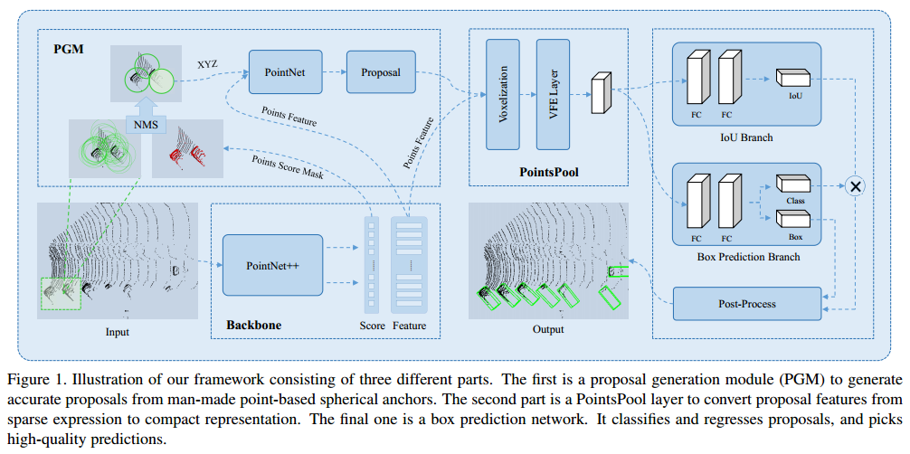
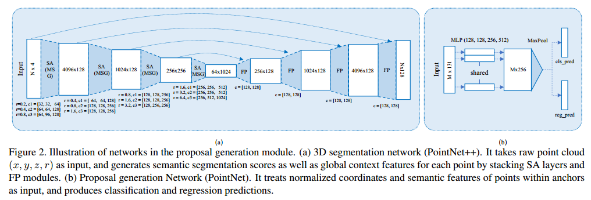
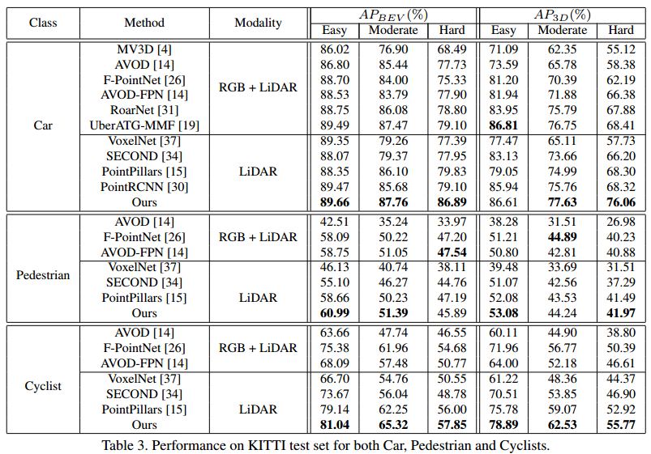

# STD论文分析
2019 腾讯优图和香港中文大学发表在ICCV上的工作。

# Motivation
针对激光雷达点云3D检测有两大类方法，一类是基于voxel的，信息损失（高度  ？）导致定位质量低。另一类是基于point的，这一类精度相对较高，但是网络的感受野不容易控制，计算量比较大。

作者提出了一个两阶段式的检测方法。这种方法结合了基于point和基于voxel两类方法的优势（？）。

# Implementation
作者也指出，这个方法是一个两阶段式方法，整个方法的框架如下图所示：

## Backbone
Backbone还是采用PointNet++，这里有个疑问，前面其实已经提到基于点的方式计算量大（主要是set abstraction(SA)耗时，要最远点采样），感受野不好控制吗，这里依然采用这种方式，不仍然会有这两个问题吗？不过后面也提高采用球形（圆柱形？）预选框控制感受野，以及将点云切分并行进行加速，不确定是不是对应的解决方案。

## Proposal Generation Module(PGM)
PGM是作为整个算法框架的第一阶段，主要目的是提取候选框，并且使召 回率尽可能的高。

这里预选框的设置是采用圆柱形的预选框，以点云中的每个点作为锚点（预选框的中心点）。相比于立方体的预选框，这种圆形框不需要设置角度，从而减小了预选框的数量。但是由于每个点都生成预选框，而每帧点云中点的个数在16K左右，从而生成的框的个数也在16K左右。Backbone会输出每个预选框属于前景的概率值，根据这个概率值可以对预选框进行非极大值抑制（NMS），最终将每帧预选框的个数限制在500左右（应该是通过控制IoU的阈值）。

这里由于是采用了圆形预选框，其正负的判定不能通过立方体那种直接交并比的方法来判定。文章中采用的是一种叫PointsIoU的方式来判定，PointsIoU是指预选框和真值框内的点个数与预选框和真值框并集内点的个数的比值。如果这个值大约0.55则是正样本，否则是负样本。

最终检测的目标还是一个带有角度的长方体，这里提出了一个PGN(Proposal Generation Network, PointNet的简化版)，通过圆形预选框里的点，预测目标的位置和类别。这里的输入包含两部分（3+128=131），一部分是坐标值（x,y,z），另一部分是PointNet++输出的分割特征。这里针对不同的类别设置了不同尺寸的预选回归尺寸，回归的目标是位置的差值，尺寸的差值和角度。角度回归分成了两步，先对角度进行分类，划分了12bin作为类别，然后再预测在当前bin内的残差。
这一步之后，再根据分类的得分值进行NMS，使得预选框得到进一步的控制（训练时控制到300，测试时控制到1000）。

## Proposal Feature Generation(PFG)
这一部分是提取第一阶段每个proposal内点的特征。由于proposal的个数比较多，因此需要这部分网络的推理速度要快。文中指出PointNet的速度是非常快的，但是精度比较低，而PointNet++精度虽然很高，但是SA过程太耗时，导致速度比较慢。作者提出了PointsPool，这个是VoxelNet的一个简化版本。由于这时的proposal已经是带有角度的立方体，因此可以对其进行栅格化，然后再通过VFE提取每个栅格内的特征，最后将这个3D特征flatten成1D，作为该部分的输出。

体素化的具体参数是划分成 $6 \times 6 \times 6$ 的网格，每个体素内点个数为35。VFE参数设置为（128,128,256）。

## Box Prediction Network
这部分主要是对proposal的位置进行精调。这里有两个大分支。

一个分支是用于proposal的回归和分类，接了两层全连接（512,512），预测分类概率和回归位置，尺寸以及角度，计算方式和第一阶段基本一致。

另一个分支是预测该proposal与真值框的交并比。考虑到之前的3D检测算法在对最后的结果做NMS的时候，是采用分类概率值对其进行排序，然后再做NMS。而在自动驾驶场景下基于点云的3D目标检测任务，由于点云的稀疏性，分布不均匀性，以及遮挡，和激光中心的相对距离等原因，造成分类概率和位置的回归精度关系不是那么的紧密，因此，这里作者想找一个可以衡量定位精度的指标用于最后的NMS。作者最后采用的是该分支预测的交并比值和分类概率值的乘积作为NMS前排序的标准。

## 损失函数
损失函数整体来说包含两大部分：

\[
L_{total} = L_{prop} + L_{box}
\]

对于第一部分，又可以分为三个部分

\[
L_{prop} = L_{seg} + \frac{1}{N_{cls}} \sum_i L_{cls}(s_i, u_i) \\
          + \lambda \frac{1}{N_{pos}} \sum_i[u_i \geq 1] (L_{loc} + L_{ang})
\]
$L_{seg}$ 是采用的Focal Loss。
第一阶段预测目标的设置：

\[
G_{ctr} = G_j - A_j , j \in (x, y, z) \\
G_{size} = (G_j - A_j) / A_j \in (l, w, h)
\]

对于角度的回归

\[
L_{ang} = L_{cls}(t_{a-cls}, v_{a-cls}) + L_{dis}(t_{a-res}, v_{a-res})
\]

所有回归任务都采用的是SmoothL1损失函数。

对于第二部分 $L_{box}$，也包含两个部分，其实对应两个分支。
对IoU的回归是采用SoomthL1损失，对位置回归是采用8个顶点的差值：

\[
L_{corner} = \sum^8_{k=1} || P_k - G_k ||
\]

## 网络参数设置
点云在输入前需要对点进行采样，采样为16K个点。
在box预测部分的两个分支都是采用2层512个神经元的全连接。

## 训练过程
两个阶段是分开训练的，采用ADAM学习器。

第一阶段总共训了了100个epochs。前80个epochs设置的学习率是从0.001降到0.0001。Batch size为16，用了4张Titan V。

第二阶段训了50个epochs ，前40个epochs的学习率为0.001,之后每5个epochs以0.1的倍率衰减。Batch size为1（这里的1是指1帧点云？），没帧点云采样256个proposal，按照正负样本1:1的比例进行采样。

对于第二阶段IoU预测值的训练，只对正样本的IoU进行预测。对于Car，当proposal与真值框的交并比大约0.55时为正样本，小于0.45时为负样本。对于其他两类，阈值为0.5和0.4。（这样不会导致预测值都在0.5-1范围内？该预测分支不会有bias？）

## 数据增广
基本和SECOND一致。

## 实验结果

