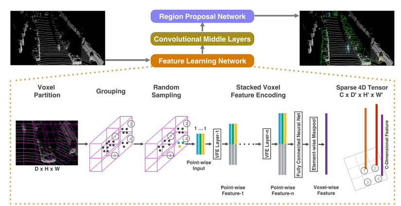
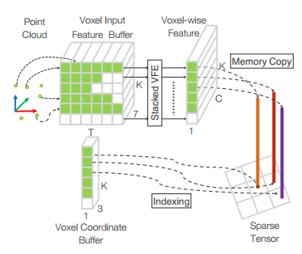
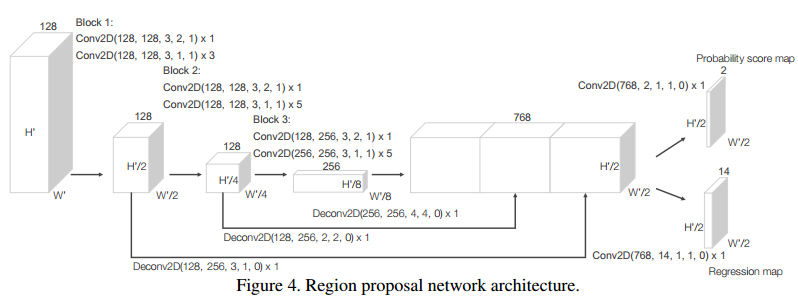
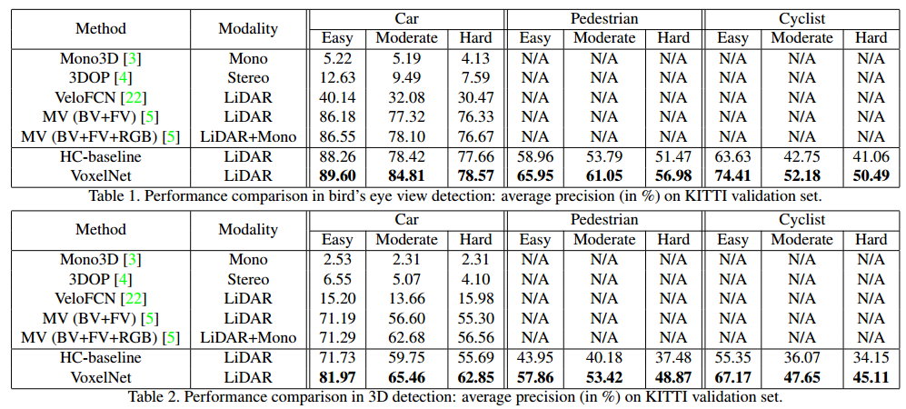

# VoxelNet论文分析
VoxelNet是2017年苹果公司Yin Zhou和Oncel Tuzel提出了一种针对激光雷达原始点云进行3D目标检测的工作。

 ## Motivation
 1. 由于激光雷达点云对三维空间不均匀采样，传感器的有效测量距离，遮挡和相对位姿等因素造成了激光雷达点云的稀疏性和点云密度的不均匀性（highly variable point density）。手工设计的特征会引入一些信息障碍，导致这些特征无法提取有效的3D形状信息和检测任务所需的不变性。（这里手工设计特征（handcrafted features）是指对点云进行投影，或对voxel内的点进行设计特征）
 2. PointNet和PointNet++这些都是针对点云设计的点云分析网络，但是为了达到满意的结果，这些点云分析网络需要把所有的点作为输入，通常来讲，激光雷达点云的量级会再100k以上，如果把所有的点都放入到网络，对计算量和内存会造成很大的影响。
 3. RPN(region proposal network)通常来讲是需要数据是稠密的张亮形式，而原始点云不符合这种形式。

基于以上三点，作者提出了VoxelNet，目的是实现在不同量级的点云上实现三维特征学习和三维目标检测。

##  Implementation
整个网络的实现过程分为三个部分，如下图所示

### 第一部分VFE
第一部分VFE是voxel feature encoding layer的缩写。主要任务是提取每个voxel内点云的特征。实现对每个voxel内点之前，需要对整个点云进行划分成多个voxel。这里称之为voxel partition。

#### 栅格分割（Voxel Partition）
整个点云在X, Y, Z方向上的空间范围分别是W, H, D。每个voxel的尺寸为$v_W, v_H, v_D$，则整个空间划分的voxel的网格尺寸为$W/v_W, H/v_H, D/v_D$。

### 随机采样（Random Sample）
栅格划分完之后，每个栅格内会落入一些点，由于点云的稀疏性和分布不均性，会导致栅格和栅格之间落入点的个数不同。另一方面，不同质量的激光雷达生成点云的密度不同，落入栅格内点的个数也不同，作者希望即使点云密度增加，算法的计算量也保持相同。因此，采取随机采样的策略，即每个栅格内采样固定个数的点。作者提到这种做法有两种好处，一个是减少了计算量，另一个是降低了不同voxel之间的点个数的不均衡，从一定程度上是一种数据增广。当然还有一个附加的好处是程序实现时好处理。[但是这里也存在一个潜在的问题，固定个数T的设置，T小了会损失很多信息，T大了会导致很多voxel里面并没有这么多点而需要重复采用生成T个点，从而一定程度上增加了计算量。]

### Stacked VFE
voxel划分好了,下一步就是要提取每个voxel的特征。每个voxel的特征提取网络是由多个VFE堆叠而成。第一个VFE的输入包含7个特征（$x_i, y_i, z_i, r_i, x_i-v_x, y_i-v_y, z_i-v_z$）。输入特征是经过一个线性全连接，一个BN（batch normalization）还有一个ReLU的激活层。此外还配有一个MaxPooling层，是起到聚合局部特征的左右，将聚合后的局部特征拼接到激活层后的输出特征上作为特征输出。特征提取网络的最后一层是一个全连接层接一个MaxPooling层聚合voxel的特征。最后得到一个C维的特征。

在实现的过程中会面临一个问题，即大多数的voxel可能是空的，为了减少对存储和计算的需求，应该只对那些非空的voxel进行操作。为了恢复特征后特征的空间排列，需要存储每个voxel的索引值。

## Conv Middle Layers
前面的VFE特征提取只是针对每个voxel内的点云特征，这一部分是要针对整个点云空间中的相邻特征进行特征提取。这篇文章是采用的3D卷积，因此，接受的输入维度为$C \times D' \times H' \times W'$，每层由3D卷积，BN和池化构成。

## RPN

由于RPN是在2D的特征图上进行操作，因此需要将Middle layer得到的特征进行reshape，即将 $C \times D' \times H' \times W'$ 转换为 $(C D') \times H' \times W'$。RPN最后的决策特征是由三个不同尺度的特征图上采样拼接得到，最终的学习目标包含两部分，1）每个位置包含物体的概率，2）对目标值的回归。

## 损失函数
RPN的预测值是相对于预选框（anchor）的残差值，每个像素点预测7个值，其定义如下：

\[
\Delta x = \frac{x^g_c - x^a_c}{d^a},
\Delta y = \frac{y^g_c - y^a_c}{d^a},
\Delta z = \frac{z^g_c - z^a_c}{h^a} \\
\Delta l = log(\frac{l^g}{l^a}),
\Delta w = log(\frac{w^g}{w^a}),
\Delta h = log(\frac{h^g}{h^a}) \\
\Delta \theta = \theta ^g - \theta ^a
\]

其中 $d^a = \sqrt {(l^a)^2+(w^a)^2}$ 是预选框对角线长度。则损失函数的定义为：

\[
L = \alpha \frac{1}{N_{pos}} \sum_i L_{cls}(p^{pos}_i, 1) + \beta \frac{1}{N_{neg}} \sum_j L_{cls}(p^{neg}_j, 0) \\+ \frac{1}{N_{pos}} \sum_i L_{reg}(u_i, u^g_i)
\]

其中分类损失采用两类交叉熵损失，回归损失采用SmoothL1损失。$\alpha,\beta$是衡量正负样本不均衡的权重。

## 训练细节
论文中网络的训练时在KITTI 3D检测数据集上进行训练。KITTI 3D检测数据集使用的是Velodyne 64线激光雷达。

### Voxel参数选择
对于不同类别物体的检测，采用不同的参数进行体素化。

#### Car
点云空间范围[-3,1]$\times$[-40,40]$\times$[0,70.4]，单位m；

Voxel尺寸$v_D=0.4,v_H=0.2,v_W=0.2$，因此$D'=10, H'=400, W'=352$；

每个Voxel内采样点的个数T=35；

网络结构：

2层VFE，3层Conv3D，参数分别为：

VFE-1(7, 32) -> VFE-2(32, 128)

($128 \times 10 \times 400 \times 352$)

-> Conv3D(128, 64, 3, (2,1,1),(1,1,1)) -> Conv3D(64, 64, 3, (1,1,1), (0,1,1)) -> Conv3D(64, 64, 3, (2,1,1), (1,1,1))

->($(64 \times 2) \times 400 \times 352$) -> RPN

预选框的设置：
$l^a=3.9,w^a=1.6,h^a=1.56, z^a_c=-1.0, \theta={0,90}$。

正负样本的确定：
预测框在BEV平面上与真实框的交并比（IoU）大约0.6为正样本，小于0.45为负样本，处于中间的不考虑。（如果同一位置有很多大约0.6的框，是只取IoU最大的还是只要大约0.6都是正样本？）

$\alpha=1.5,\beta=1$

### Pedestrian和Cyclist
点云空间范围[-3,1]$\times$[-20,20]$\times$[0,48]，单位m；

点云空间范围[-3,1]$\times$[-40,40]$\times$[0,70.4]，单位m；

Voxel尺寸$v_D=0.4,v_H=0.2,v_W=0.2$，因此$D'=10, H'=200, W'=240$；

每个Voxel内采样点的个数T=45；

预选框的设置：
$l^a=0.8,w^a=0.6,h^a=1.73, z^a_c=-0.6, \theta={0,90}$。

正负样本交并比阈值0.5和0.35。

### 训练过程
前150个epochs是采用学习率为0.01的SGD,最后10个epoch学习率下降到0.001，batch size为16。

### 数据增广
数据增广主要是针对三个方面：
1. 对每个真值框的增广包含两步：1）在一定范围 $[-\pi/10, \pi/10]$ 内对框进行选择，2）对真值框的位置进行添加扰动，扰动是服从均值为0，标准差为1.的高斯分布。
2. 对整个点云和真值框进行缩放，缩放比例范围为[0.95, 1.05]，选择服从均匀分布。
3. 对整个点云进行旋转，旋转的角度的范围是 $[-\pi/4, \pi/4]$，旋转服从均匀分布。

### 实验结果

实验结果中HC-baseline是采用hand-crafted特征作为输入，将对应3D卷积的部分改成2D的，效果看起来要比MV3D的效果要好。输入是采用16个高度channel，分辨率为0.1。

2D Middle Layers:
Conv2D(16, 32, 3, 1, 1) -> Conv2D(32, 64, 3, 2, 1) -> Conv2D(64, 128, 3, 1, 1)
